# Enterprise AWS Solution Map & Repository Architecture Blueprint

## Executive Overview & Architectural Foundation

This repository provides an autonomous, end-to-end **Enterprise AWS Solution Map & Repository Architecture Blueprint** engineered to meet Tier-1 enterprise standards for security, scalability, resilience, compliance, and cost governance.

Designed by Principal Solutions Architects and Enterprise Platform Engineers, this blueprint decomposes enterprise cloud infrastructure into **11 decoupled capability domains**, orchestrated through strict Infrastructure-as-Code (IaC) repository boundaries, well-defined SSM/Secrets Manager contracts, and standardized multi-account governance.

```
                                  +-------------------------------------------------------------+
                                  |                 AWS Organizations Master Root               |
                                  |             o-enterpriseorg123 (Billing / SCPs)             |
                                  +------------------------------+------------------------------+
                                                                 |
            +------------------------------------+---------------+------------------------------------+
            |                                    |                                                    |
+-----------v-----------+            +-----------v-----------+                            +-----------v-----------+
|    Core Infrastructure|            |        Security       |                            |    Workloads & Apps   |
+-----------+-----------+            +-----------+-----------+                            +-----------+-----------+
            |                                    |                                                    |
   +--------+--------+                  +--------+--------+                                  +--------+--------+
   |                 |                  |                 |                                  |                 |
+--v--------+ +------v---+          +---v-------+ +-------v---+                          +---v-------+ +-------v---+
|  Network  | | Shared   |          |  SecOps   | | Log       |                          |  Prod     | | Non-Prod  |
|  Hub      | | Services |          |  Admin    | | Archive   |                          |  Workloads| | Workloads |
+-----------+ +----------+          +-----------+ +-----------+                          +-----------+ +-----------+
```

---

## Blueprint Navigation & Domain Specifications

| Domain | Capability Domain Title | Target Repository | Specification Link |
| :---: | :--- | :--- | :--- |
| **01** | Multi-Account Landing Zone & Core Network Fabric | `terraform-aws-landing-zone-network-fabric` | [01-multi-account-landing-zone-network-fabric.md](docs/01-multi-account-landing-zone-network-fabric.md) |
| **02** | Hybrid & Multi-Cloud Connectivity | `terraform-aws-hybrid-multicloud-connectivity` | [02-hybrid-multi-cloud-connectivity.md](docs/02-hybrid-multi-cloud-connectivity.md) |
| **03** | Centralized Identity, KMS & Security Posture | `terraform-aws-central-identity-kms-security` | [03-centralized-identity-kms-security-posture.md](docs/03-centralized-identity-kms-security-posture.md) |
| **04** | Central Observability, Telemetry & Compliance | `terraform-aws-central-observability-compliance` | [04-central-observability-telemetry-compliance.md](docs/04-central-observability-telemetry-compliance.md) |
| **05** | FinOps & Cost Governance | `terraform-aws-finops-cost-governance` | [05-finops-cost-governance.md](docs/05-finops-cost-governance.md) |
| **06** | Data Persistence, Streaming & Lakehouse Foundations | `terraform-aws-data-persistence-lakehouse` | [06-data-persistence-streaming-lakehouse.md](docs/06-data-persistence-streaming-lakehouse.md) |
| **07** | Compute & Container Platforms | `terraform-aws-compute-container-platforms` | [07-compute-container-platforms.md](docs/07-compute-container-platforms.md) |
| **08** | Application Integration & Asynchronous Orchestration | `terraform-aws-application-integration-orchestration` | [08-application-integration-async-orchestration.md](docs/08-application-integration-async-orchestration.md) |
| **09** | Edge Security, Content Delivery & Routing | `terraform-aws-edge-security-routing` | [09-edge-security-content-delivery-routing.md](docs/09-edge-security-content-delivery-routing.md) |
| **10** | AI/ML Inference & Enterprise Guardrails | `terraform-aws-aiml-inference-guardrails` | [10-aiml-inference-enterprise-guardrails.md](docs/10-aiml-inference-enterprise-guardrails.md) |
| **11** | Disaster Recovery & Business Continuity | `terraform-aws-disaster-recovery-resilience` | [11-disaster-recovery-business-continuity.md](docs/11-disaster-recovery-business-continuity.md) |

---

## Inter-Module Contracts & Shared Catalogs

- **[SSM Parameter Store Schema](contracts/ssm-parameter-schema.json)**: JSON schema specification defining cross-module input/output parameters across all 11 domains.
- **[IAM Baseline Matrix & Guardrails](contracts/iam-baseline-matrix.md)**: Standardized IAM roles, OIDC pipeline federations, Service Control Policies (SCPs), and Resource Control Policies (RCPs).
- **[Network CIDR & IPAM Hierarchy](contracts/network-cidr-ipam-allocations.md)**: RFC 1918 supernet allocations, TGW route table matrix, and AZ subnet distribution.
- **[IaC Dependency Graph & Orchestration](iac-catalogs/modules-dependency-matrix.md)**: Sequential execution pipeline and dependency topology.
- **[Terragrunt Root Configuration](iac-catalogs/terragrunt-root.hcl)**: Dynamic provider generation, KMS-encrypted S3 remote state backend, and DynamoDB lock configurations.

---

## Global Enterprise Architectural Topology

```mermaid
flowchart TB
    subgraph Global_Edge_Perimeter["Domain 09: Global Edge Perimeter & Route 53 DNS"]
        R53_ARC["Route 53 ARC Routing Controls (5-Region Quorum)"]
        CloudFront_Edge["Amazon CloudFront CDN (Origin Shield & OAC)"]
        WAF_Global["AWS WAF (Bot Control / Rate Limiting)"]
        Shield_L3_L4["AWS Shield Advanced DDoS Protection"]
    end

    subgraph AWS_Hub_and_Governance["Core Hub & Central Governance Accounts"]
        
        subgraph Domain_01_02["Domain 01 & 02: Network Hub & Hybrid Ingress"]
            TGW_Core["AWS Transit Gateway (Multi-AZ)"]
            NFW_Cluster["AWS Network Firewall (Stateful DPI)"]
            DXGW_CloudWAN["Direct Connect Gateway & AWS Cloud WAN"]
            R53_Resolver_Hub["Route 53 Resolver (Inbound/Outbound/Firewall)"]
        end

        subgraph Domain_03_04_05["Domain 03, 04 & 05: SecOps, Observability & FinOps"]
            SecHub_GuardDuty["Security Hub & GuardDuty Delegated Admin"]
            KMS_MultiRegion_Vault["KMS Multi-Region CMKs & Secrets Manager"]
            CW_OAM_OpenSearch["CloudWatch OAM Sink & Amazon OpenSearch"]
            S3_Log_Archive["S3 Log Vault (Object Lock Compliance Mode)"]
            CUR_FinOps_Lake["CUR 2.0 Parquet & FinOps Analytics"]
        end

    end

    subgraph Primary_Region_Workloads["Primary Region (us-east-1): Production Workloads"]
        
        subgraph Domain_07["Domain 07: Compute Platforms & Service Mesh"]
            EKS_Cluster_Prod["Amazon EKS (Karpenter Graviton / Bottlerocket)"]
            VPC_Lattice_Mesh["Amazon VPC Lattice (Zero-Trust SigV4 Mesh)"]
        end

        subgraph Domain_06["Domain 06: Data Persistence & Streaming"]
            Aurora_Primary["Aurora Serverless v2 (PostgreSQL Multi-AZ)"]
            RDS_Proxy_Pool["Amazon RDS Proxy (Connection Pooler)"]
            DDB_Global_Tables["Amazon DynamoDB Global Tables"]
            MSK_Kafka_Streams["Amazon MSK Kafka & S3 Lakehouse (Iceberg)"]
        end

        subgraph Domain_08["Domain 08: Asynchronous Orchestration"]
            EB_Central_Bus["Amazon EventBridge Central Bus"]
            StepFunctions_Saga["AWS Step Functions (Distributed Saga Workflow)"]
            SQS_SNS_Fanout["Amazon SQS FIFO & SNS Data Protection"]
        end

        subgraph Domain_10["Domain 10: AI/ML Inference & Guardrails"]
            Bedrock_Engine["Amazon Bedrock (Claude 3.5 / Titan)"]
            Bedrock_Guardrails["Bedrock Guardrails (PII Redaction / Anti-Jailbreak)"]
            AOSS_Vector_RAG["OpenSearch Serverless (Vector RAG Index)"]
        end

    end

    subgraph Secondary_DR_Region["Secondary DR Region (us-west-2): Domain 11 Resilience"]
        Aurora_Secondary["Aurora Global DB (Storage Replicated)"]
        DRS_Target_Fleet["AWS DRS Staging & Target Recovered Fleet"]
        EKS_Standby["Standby EKS Compute (Scaled on Failover)"]
        AirGap_Backup_Vault["Air-Gapped AWS Backup Central Vault (WORM)"]
    end

    %% Edge Ingress Flows
    CloudFront_Edge --- WAF_Global
    CloudFront_Edge --- Shield_L3_L4
    CloudFront_Edge -->|SigV4 Signed Ingress| EKS_Cluster_Prod
    R53_ARC -.->|Traffic Health Switching| Primary_Region_Workloads
    R53_ARC -.->|Automated Failover| Secondary_DR_Region

    %% Network & Hub Routing
    DXGW_CloudWAN <--> TGW_Core
    TGW_Core <--> NFW_Cluster
    NFW_Cluster <--> Primary_Region_Workloads

    %% Compute & Data / Mesh
    EKS_Cluster_Prod <--> VPC_Lattice_Mesh
    EKS_Cluster_Prod --> RDS_Proxy_Pool --> Aurora_Primary
    EKS_Cluster_Prod --> DDB_Global_Tables
    EKS_Cluster_Prod --> MSK_Kafka_Streams

    %% App Integration
    EKS_Cluster_Prod --> EB_Central_Bus --> StepFunctions_Saga
    EB_Central_Bus --> SQS_SNS_Fanout

    %% AI / ML Integrations
    EKS_Cluster_Prod --> Bedrock_Guardrails --> Bedrock_Engine
    Bedrock_Engine <--> AOSS_Vector_RAG

    %% Telemetry & Auditing
    Primary_Region_Workloads -.->|OAM Telemetry| CW_OAM_OpenSearch
    Primary_Region_Workloads -.->|Audit Trails| S3_Log_Archive
    SecHub_GuardDuty -.->|Threat Alerts| EB_Central_Bus

    %% Disaster Recovery Continuous Replication
    Aurora_Primary -->|Sub-second Storage Sync| Aurora_Secondary
    EKS_Cluster_Prod -.->|Continuous Block Sync| DRS_Target_Fleet
    Aurora_Primary -.->|Cross-Account Air-Gapped Copy| AirGap_Backup_Vault
```



---

## Day-2 Operational Runbooks & SRE Incident Playbooks

### Playbook 1: Regional Catastrophic Disaster Recovery Failover (Route 53 ARC + Aurora Global)
1. **Trigger Condition**: Continuous loss of health checks across primary region ingress ALBs and Route 53 ARC Readiness Check alarms firing.
2. **Execution Steps**:
   - **Step 1**: SRE on-call executes Route 53 ARC CLI command or automated Step Function to atomically flip Routing Control from `us-east-1` (0) to `us-west-2` (1):
     ```bash
     aws route53-recovery-control-config update-routing-control-states \
       --routing-control-states-entries "[{\"RoutingControlArn\":\"arn:aws:route53-recovery-control::111111111111:control/primary-us-east-1\",\"RoutingControlState\":\"Off\"},{\"RoutingControlArn\":\"arn:aws:route53-recovery-control::111111111111:control/secondary-us-west-2\",\"RoutingControlState\":\"On\"}]"
     ```
   - **Step 2**: Promote the secondary Aurora PostgreSQL cluster to standalone writer:
     ```bash
     aws rds failover-global-cluster \
       --global-cluster-identifier enterprise-aurora-global \
       --target-db-cluster-identifier enterprise-aurora-secondary-cluster
     ```
   - **Step 3**: Karpenter automatically scales EKS pods in `us-west-2` based on target traffic demand.

### Playbook 2: Automated Compromised IAM Credential Containment (GuardDuty + EventBridge)
1. **Trigger Condition**: Amazon GuardDuty emits finding `UnauthorizedAccess:IAMUser/InstanceCredentialExfiltration.OutsideAWS`.
2. **Execution Steps**:
   - EventBridge captures finding and triggers AWS Systems Manager Automation document `AWS-RevokeOlderURLSessions`.
   - Automation script attaches an inline `DenyAllBeforeTimestamp` IAM policy to the affected role, terminating all active temporary sessions immediately.
   - PagerDuty notification is broadcast to SOC channel with root-cause principal ID and source IP.

---

## Verification & Compliance Checklist

- [x] **Zero Hardcoded Static Credentials**: 100% human access via IAM Identity Center (SSO); 100% machine access via OIDC / IAM Roles Anywhere / EKS Pod Identity.
- [x] **No Spoke Direct Internet Gateways**: All egress forced through centralized AWS Network Firewall cluster with Suricata IPS inspection.
- [x] **Envelope Encryption Standard**: All storage engines (EBS, S3, RDS, DynamoDB, Secrets Manager) encrypted with Customer Managed Keys (CMKs) in AWS KMS.
- [x] **WORM Compliance Retention**: S3 Object Lock and AWS Backup Vault Lock in Compliance Mode protecting forensic audit logs and critical backups.
- [x] **Sub-15 Minute RTO / Sub-1 Minute RPO**: Verified across Aurora Global Database, DynamoDB Global Tables, and AWS Elastic Disaster Recovery (DRS).
