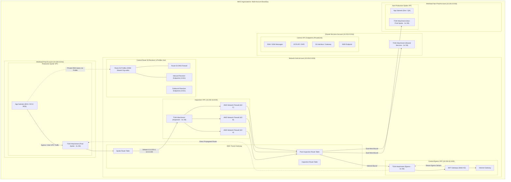

# Domain 1: Multi-Account Landing Zone & Core Network Fabric

## 1. Capability Scope & Service Taxonomy

### 1.1 Primary Purpose & Domain Boundaries
The Multi-Account Landing Zone and Core Network Fabric establishes the secure, compliant, multi-account foundation and foundational IP transport architecture for the enterprise. It establishes account separation across security, operations, shared infrastructure, and workload domains, governed by AWS Organizations, Control Tower, Service Control Policies (SCPs), and Resource Control Policies (RCPs).

The domain boundary encapsulates:
- **Organizational Hierarchy & OU Topology**: Core OU (Security, Log Archive, Shared Services, Network), Workload OUs (Prod, Non-Prod, Sandbox), and Governance OUs (Policy Staging, Suspended).
- **Core Network Backbone**: Hub-and-spoke transit topology leveraging AWS Transit Gateway (TGW) across multiple Availability Zones, centralized Inspection VPC with AWS Network Firewall (or third-party NGFW appliances), Ingress VPC, and Egress VPC.
- **Enterprise DNS & Route 53 Profiles**: Centralized Route 53 Profiles aggregating Private Hosted Zones (PHZs), Resolver Rules, and DNS Firewall Rule Groups into a unified entity shared across all AWS Organization member accounts via AWS RAM, eliminating legacy 300-VPC association limits.
- **Centralized VPC Endpoint Architecture**: Consolidated Interface VPC Endpoints (AWS PrivateLink) in Shared Services/Network VPCs exposed to all spoke VPCs via Route 53 Profiles and TGW routing to prevent endpoint proliferation and cost sprawl.
- **Dual-Stack IPAM Hierarchy**: Comprehensive IPv4 supernet and IPv6 Global Unicast Address (GUA) management preventing IP exhaustion.

```
+---------------------------------------------------------------------------------------+
|                               AWS Organizations Root                                  |
+-------------------------------------------+-------------------------------------------+
                                            |
         +----------------------------------+----------------------------------+
         |                                  |                                  |
+--------v--------+                +--------v--------+                +--------v--------+
|  Core / Infra   |                |    Security     |                |    Workloads    |
+--------+--------+                +--------+--------+                +--------+--------+
         |                                  |                                  |
   +-----+-----+                      +-----+-----+                      +-----+-----+
   |           |                      |           |                      |           |
+--v---+   +---v---+              +---v---+   +---v---+              +---v---+   +---v---+
| Net  |   | Shared|              | SecOps|   | Log   |              | Prod  |   | Non-  |
| Hub  |   | Svcs  |              | Tool  |   |Archive|              | (App) |   | Prod  |
+------+   +-------+              +-------+   +-------+              +-------+   +-------+
```

### 1.2 Core AWS Services & Modern Capabilities
- **AWS Control Tower & AWS Organizations**: Multi-account lifecycle management, Account Factory for Terraform (AFT), baseline guardrails, and SCP/RCP governance.
- **AWS Transit Gateway (TGW)**: Multi-VPC and hybrid interconnectivity with segmented Route Tables (Spoke-RT, Ingress-RT, Egress-RT, Inspection-RT) and Appliance Mode support.
- **AWS Route 53 Profiles**: Modern DNS management construct bundling PHZs, Resolver Rules, and DNS Firewall rules into an Organization-wide RAM-shareable profile.
- **AWS Network Firewall (NFW)**: Stateful and stateless Deep Packet Inspection (DPI), Suricata-compatible IPS/IDS rules, domain name filtering, and TLS inspection at scale.
- **AWS RAM (Resource Access Manager)**: Cross-account sharing of TGW, Route 53 Profiles, Subnets, and AWS Network Firewall endpoints.
- **AWS VPC IPAM (IP Address Manager)**: Hierarchical IPv4/IPv6 CIDR pool allocation, IP address tracking, and overlapping CIDR prevention across multiple AWS Regions and on-premises ranges.
- **Resource Control Policies (RCPs)**: Modern identity-perimeter guardrails restricting resource access at the AWS Organizations boundary with service principal bypass exceptions (`aws:PrincipalIsAWSService`).

---

## 2. IaC Repository Boundary & Inter-Module Contracts

### 2.1 Dedicated Repository Naming & Layout
- **Repository Name**: `terraform-aws-landing-zone-network-fabric`
- **Engine**: Terraform >= 1.9.0 with AWS Provider >= 5.60.0 (or OpenTofu >= 1.8.0)

```
terraform-aws-landing-zone-network-fabric/
├── .github/
│   └── workflows/
│       ├── lint-validate.yml
│       └── terratest-pipeline.yml
├── config/
│   ├── root-org.tfvars
│   ├── network-core-us-east-1.tfvars
│   └── network-core-eu-west-1.tfvars
├── modules/
│   ├── org-hierarchy/
│   │   ├── main.tf
│   │   ├── scp_guardrails.tf
│   │   ├── rcp_guardrails.tf
│   │   ├── outputs.tf
│   │   └── variables.tf
│   ├── ipam-core/
│   │   ├── main.tf
│   │   ├── pools_ipv4.tf
│   │   ├── pools_ipv6.tf
│   │   └── outputs.tf
│   ├── transit-gateway/
│   │   ├── main.tf
│   │   ├── route_tables.tf
│   │   ├── ram_sharing.tf
│   │   └── outputs.tf
│   ├── inspection-vpc/
│   │   ├── main.tf
│   │   ├── network_firewall.tf
│   │   ├── routing.tf
│   │   └── outputs.tf
│   ├── route53-profiles-core/
│   │   ├── main.tf
│   │   ├── profile_associations.tf
│   │   ├── ram_share.tf
│   │   └── outputs.tf
│   ├── route53-resolver-core/
│   │   ├── main.tf
│   │   ├── endpoints.tf
│   │   ├── firewall_rules.tf
│   │   └── outputs.tf
│   └── centralized-vpc-endpoints/
│       ├── main.tf
│       ├── endpoints.tf
│       └── phz_records.tf
├── live/
│   ├── root-management/
│   │   ├── terragrunt.hcl
│   │   └── main.tf
│   ├── network-hub/
│   │   ├── terragrunt.hcl
│   │   └── main.tf
│   └── shared-services/
│       ├── terragrunt.hcl
│       └── main.tf
├── tests/
│   └── integration_test.go
├── versions.tf
└── README.md
```

### 2.2 Cross-Module Contracts & Dependencies
The Landing Zone & Core Network Fabric publishes authoritative contract state to AWS Systems Manager (SSM) Parameter Store in the Network Hub and Master accounts, replicated across regions.

#### SSM Parameter Store Exports:
| Parameter Path | Type | Consumer / Scope | Purpose |
| :--- | :--- | :--- | :--- |
| `/enterprise/network/tgw/id` | String | All Spoke VPC Repositories | Target TGW ID for Spoke VPC VPC-TGW attachments |
| `/enterprise/network/tgw/spoke-rt-id` | String | All Spoke VPC Repositories | TGW Route Table to associate spoke attachments with |
| `/enterprise/network/dns/inbound-resolver-ips` | StringList | Hybrid Network / On-Prem DNS | Target IPs for on-premises DNS forwarding rules (`10.254.0.4,10.254.0.20,10.254.0.36`) |
| `/enterprise/network/dns/outbound-endpoint-id` | String | Route 53 Rules Manager | Route 53 Outbound Endpoint ID for conditional forwarding |
| `/enterprise/network/dns/r53-profile-arn` | String | All Spoke Workload Accounts | Route 53 Profile ARN shared across Org via RAM |
| `/enterprise/network/ipam/workload-prod-pool-id` | String | Workload Prod Account VPCs | IPAM Pool ID for dynamic Spoke CIDR provisioning |
| `/enterprise/network/ipam/workload-nonprod-pool-id` | String | Workload Non-Prod Account VPCs | IPAM Pool ID for Non-Prod Spoke CIDR provisioning |
| `/enterprise/security/rcp/enforced-org-id` | String | Global KMS / S3 / IAM Blueprints | Organization ID enforced in Resource Control Policies |

#### Remote State & Inter-Module Dependencies:
- **Upstream Dependencies**: None (Root Foundation).
- **Downstream Consumers**: Domain 2 (Hybrid Connectivity), Domain 3 (Central KMS/Security), Domain 4 (Central Logging), Domain 6 (Data Platform), Domain 7 (Compute/EKS).

#### IAM Baseline Assumptions:
- `AWSAccelerator-NetworkAdminRole` / `OrganizationAccountAccessRole` with cross-account assume role permissions scoped to `arn:aws:iam::<AccountID>:role/terraform-network-provisioner`.
- SCPs strictly prohibit direct Internet Gateway (`aws:ec2:internet-gateway`) creation in any spoke account VPC.

---

## 3. Architecture Topology Diagram



---

## 4. Expert Architectural Review & Trade-off Critique

### 4.1 Well-Architected Assessment
- **Security**:
  - *Perimeter Enforcement*: No public IP allocations or IGWs in workload spoke accounts. Egress is mandatorily steered through AWS Network Firewall with Suricata stateful filtering and TLS inspection.
  - *Resource Control Policies (RCPs)*: Enforces strict data-perimeter boundaries (`aws:PrincipalOrgID`) with explicit AWS service principal exceptions (`aws:PrincipalIsAWSService: false`).
- **Reliability**:
  - *Multi-AZ Symmetry*: Transit Gateway attachments, AWS Network Firewall endpoints, NAT Gateways, and Route 53 Resolver endpoints are provisioned across 3 AZs.
  - *TGW Appliance Mode*: Explicitly enabled on the Inspection VPC attachment (`appliance_mode_support = "enable"`) to prevent asymmetric routing drops during stateful packet inspection across AZs.
- **Operational Excellence**:
  - *Route 53 Profiles Adoption*: Bundles PHZs, DNS Firewall Rules, and Resolver Rules into a single RAM-shared profile, eliminating the 300-VPC association limit and manual VPC link pipelines.
  - *Dual-Stack IPAM Management*: Automated allocation via AWS VPC IPAM manages IPv4 supernets and IPv6 GUAs, eliminating subnet calculation errors.
- **Cost Optimization**:
  - *Centralized VPC Endpoints*: Centralizing high-frequency interface endpoints (SSM, ECR, KMS) saves up to 75% on per-VPC hourly interface charges ($0.01/hr per AZ per endpoint across hundreds of accounts).
  - *Local S3 & DynamoDB Gateway Endpoints*: Spoke VPCs provision free local Gateway Endpoints in their subnet route tables, bypassing TGW data transfer fees ($0.02/GB) for bulk lakehouse and object storage traffic.
  - *TGW Data Processing Trade-off*: Centralized egress incurs $0.02/GB TGW processing plus NAT Gateway charges; return egress routes directly to Spoke VPCs via `Egress-RT` propagations, eliminating double-processing fees.

### 4.2 Critical Architectural Risks & Mitigations

#### Risk 1: Asymmetric Routing Packet Drops in Inspection VPC
- **Failure Mechanism**: AWS Transit Gateway routes return traffic via a different AZ from the forward traffic if Appliance Mode is not active. The stateful AWS Network Firewall drops the connection mid-handshake because the SYN-ACK packet bypasses the state table.
- **Mitigation Strategy**:
  1. Enforce `appliance_mode_support = "enable"` on all TGW attachments to the Inspection VPC in Terraform.
  2. Implement separate routing tables for inspection ingress and egress to guarantee deterministic symmetrical flow back into the TGW.
  3. Ensure `Egress-RT` propagates Spoke VPCs directly to prevent circular re-inspection loops on return internet responses.

#### Risk 2: Route 53 Resolver Throttling during Large-Scale Fleet Spin-Up
- **Failure Mechanism**: Rapid horizontal autoscaling querying centralized Route 53 endpoints can exceed the ENI quota of 10,000 QPS per IP, causing silent DNS timeouts.
- **Mitigation Strategy**:
  1. Deploy NodeLocal DNSCache in EKS clusters to serve 90%+ queries locally without touching VPC resolvers.
  2. Scale Route 53 Resolver ENIs across at least 4 AZs with auto-monitoring alarms on `ResolverQueryRateExceeded` metrics.

