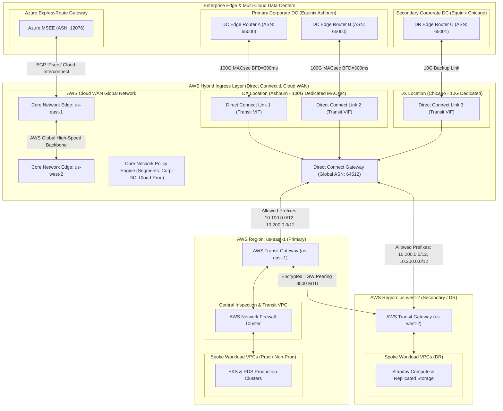

# Domain 2: Hybrid & Multi-Cloud Connectivity

## 1. Capability Scope & Service Taxonomy

### 1.1 Primary Purpose & Domain Boundaries
The Hybrid & Multi-Cloud Connectivity domain establishes deterministic, enterprise-grade, encrypted, and resilient IP transport between on-premises enterprise data centers, colocation facilities (Equinix, Megaport), third-party cloud providers (Azure ExpressRoute / Google Cloud Interconnect), and the AWS multi-region backbone.

The domain boundary encapsulates:
- **Dedicated Physical Interconnects**: AWS Direct Connect (DX) Dedicated Connections (10Gbps / 100Gbps) with MACsec (802.1AE) hardware encryption at the physical layer.
- **Transit Virtual Interfaces & DX Gateway**: Multi-region DX Gateways (DXGW) attached to Transit Gateways and Cloud WAN with precise BGP Prefix filtering.
- **IPsec Over Direct Connect & Backup Site-to-Site VPNs**: BGP-over-IPsec overlay configurations using AWS Site-to-Site VPN for in-flight cryptographic compliance (FIPS 140-3) and automated path failover via BGP AS Path prepending, MED, and AWS BGP community tags.
- **AWS Cloud WAN & Global Backbone Core Network**: Modern policy-based routing using AWS Cloud WAN Global Network and Core Network Edge (CNE) attachments for automated multi-region and multi-cloud segmentation.
- **Third-Party Multi-Cloud Routing**: BGP interconnects to Azure Virtual WAN / ExpressRoute and Google Cloud Cloud Interconnect via Cloud Exchange fabric or SD-WAN virtual network appliances.

### 1.2 Core AWS Services & Modern Capabilities
- **AWS Direct Connect (DX)**: Dedicated 10G/100G connections with Transit VIFs and MACsec Layer 2 encryption.
- **Direct Connect Gateway (DXGW)**: Global routing construct connecting DX locations to multiple Transit Gateways across global AWS regions.
- **AWS Cloud WAN**: Global Network Manager, Core Network Edge (CNE) routing segments (Corp-DC, Cloud-Prod, Cloud-NonProd, MultiCloud-Transit), and policy-as-code orchestration.
- **AWS Site-to-Site VPN (Accelerated VPN)**: IPsec VPN with AWS Global Accelerator optimization and IKEv2 / AES-GCM-256 cipher suite negotiation.
- **AWS Transit Gateway Inter-Region Peering**: Encrypted inter-region AWS backbone peering with MTU 8500 (Jumbo frames) support.
- **BGP Dynamic Routing & BFD**: Sub-second link failure detection (asynchronous BFD intervals of 300ms x 3 detection multipliers) with AWS BGP Communities (`7224:7100` / `7224:7300`).

---

## 2. IaC Repository Boundary & Inter-Module Contracts

### 2.1 Dedicated Repository Naming & Layout
- **Repository Name**: `terraform-aws-hybrid-multicloud-connectivity`
- **Engine**: Terraform >= 1.9.0 with AWS Provider >= 5.60.0

```
terraform-aws-hybrid-multicloud-connectivity/
├── .github/
│   └── workflows/
│       ├── lint-validate.yml
│       └── bgp-policy-check.yml
├── config/
│   ├── dc-primary-ashburn.tfvars
│   ├── dc-secondary-chicago.tfvars
│   └── multi-cloud-azure-gcp.tfvars
├── modules/
│   ├── direct-connect-gateway/
│   │   ├── main.tf
│   │   ├── macsec_keys.tf
│   │   ├── transit_vif.tf
│   │   ├── dx_gateway_association.tf
│   │   └── outputs.tf
│   ├── ipsec-over-dx-vpn/
│   │   ├── main.tf
│   │   ├── customer_gateways.tf
│   │   ├── vpn_connections.tf
│   │   └── outputs.tf
│   ├── cloud-wan-core/
│   │   ├── main.tf
│   │   ├── core_network_policy.json
│   │   ├── segment_attachments.tf
│   │   └── outputs.tf
│   ├── tgw-inter-region-peering/
│   │   ├── main.tf
│   │   ├── peering_routes.tf
│   │   └── outputs.tf
│   └── bgp-routing-policy/
│   │   ├── main.tf
│   │   ├── prefix_filters.tf
│   │   ├── bgp_communities.tf
│   │   └── outputs.tf
├── live/
│   ├── network-primary-region/
│   │   ├── terragrunt.hcl
│   │   └── main.tf
│   └── network-secondary-region/
│   │   ├── terragrunt.hcl
│   │   └── main.tf
├── tests/
│   └── bgp_convergence_test.go
├── versions.tf
└── README.md
```

### 2.2 Cross-Module Contracts & Dependencies

#### SSM Parameter Store Exports:
| Parameter Path | Type | Consumer / Scope | Purpose |
| :--- | :--- | :--- | :--- |
| `/enterprise/hybrid/dxgw/id` | String | Domain 1 TGW Hubs | Direct Connect Gateway ID for Transit Gateway association |
| `/enterprise/hybrid/cloud-wan/core-network-id` | String | Multi-Region VPC Repositories | Cloud WAN Core Network ID for attachment creation |
| `/enterprise/hybrid/bgp/asn-aws` | String | Enterprise On-Premises Network Team | AWS BGP Autonomous System Number (e.g., `64512`) |
| `/enterprise/hybrid/bgp/asn-onprem-primary` | String | BGP Route Verification | On-Premises Primary Data Center ASN (e.g., `65000`) |
| `/enterprise/hybrid/vpn/accelerated-endpoint-ips` | StringList | Multi-Cloud / Branch Office Routers | Public Anycast IPs for Accelerated Site-to-Site VPN |
| `/enterprise/hybrid/bgp/allowed-prefixes` | StringList | Route 53 & SecOps Dashboards | CIDR blocks advertised across DXGW to on-premises |

#### Remote State & Inter-Module Dependencies:
- **Upstream Dependencies**: Domain 1 (`terraform-aws-landing-zone-network-fabric` for TGW IDs and Network Hub Route Table IDs).
- **Downstream Consumers**: Domain 1 (Central Egress / Spoke Routing), Domain 3 (AD/LDAP Domain Controller Interconnects), Domain 4 (Central Syslog Ingestion), Domain 11 (Cross-Region DR).

---

## 3. Architecture Topology Diagram



---

## 4. Expert Architectural Review & Trade-off Critique

### 4.1 Well-Architected Assessment
- **Security**:
  - *Layer 2 Physical Encryption*: 802.1AE MACsec on dedicated 100G Direct Connect circuits ensures line-rate encryption without MTU degradation.
  - *Segmentation & Route Leak Prevention*: Explicit `allowed_prefixes` configured on Direct Connect Gateway associations prevents accidental advertisement of enterprise default routes (`0.0.0.0/0`) or RFC 1918 overlaps to on-premises WAN.
- **Reliability**:
  - *Dual-Location, Dual-Port Redundancy*: Direct Connect resilience model adheres to the AWS DX Maximum Resiliency recommendations (two connections in Ashburn + two connections in Chicago across distinct DX chassis).
  - *BFD Sub-Second Convergence*: BFD active on all BGP peering sessions ensures failover detection in under 900ms (3 x 300ms timeout) compared to default BGP keepalive timeout of 90 seconds.
- **Operational Excellence**:
  - *AWS Cloud WAN Policy-as-Code*: Central JSON routing policy defines automated segment associations based on AWS resource tags (`Env=Prod` -> `segment: Cloud-Prod`).
  - *BGP Community Automation*: Uses AWS BGP communities (`7224:7100` for low preference, `7224:7300` for high preference) for deterministic path shaping.
- **Cost Optimization**:
  - *Direct Connect vs Internet Egress*: Direct Connect data egress pricing ($0.02/GB) yields 78% savings compared to standard internet egress ($0.09/GB).
  - *Cloud WAN Core Network Edge Consolidation*: Replaces N*(N-1)/2 mesh TGW peerings with a unified multi-region core network backbone.

### 4.2 Critical Architectural Risks & Mitigations

#### Risk 1: BGP Asymmetric Routing & State Table Drops via Hybrid Multi-Pathing
- **Failure Mechanism**: Traffic from on-premises to AWS enters via Direct Connect Link 1 (Ashburn), but return traffic from AWS chooses Direct Connect Link 2 (Chicago) due to ECMP or asymmetric BGP Local Preference. Stateful firewalls on-premises drop the packets.
- **Mitigation Strategy**:
  1. Implement strict BGP attribute shaping: Advertise identical specific prefixes with BGP Multi-Exit Discriminator (MED) and AS Path prepending from the secondary data center.
  2. Configure AWS Direct Connect BGP community tags: Use AWS BGP communities (`7224:7100` for low preference, `7224:7300` for high preference) to deterministically influence AWS egress path selection.

#### Risk 2: Direct Connect Gateway Prefix Limit Overflow
- **Failure Mechanism**: AWS Direct Connect Gateway enforces a hard quota of 200 allowed prefixes advertised from AWS to on-premises. Rapid multi-account VPC onboarding causes BGP sessions to reset.
- **Mitigation Strategy**:
  1. Enforce strict CIDR summarization at the IPAM root: Group all spoke VPCs into regional supernets (`10.100.0.0/12` for US East, `10.200.0.0/12` for US West).
  2. Maintain a single aggregated prefix advertisement in the DXGW association contract, strictly rejecting `/24` or `/28` spoke-level route injections.
