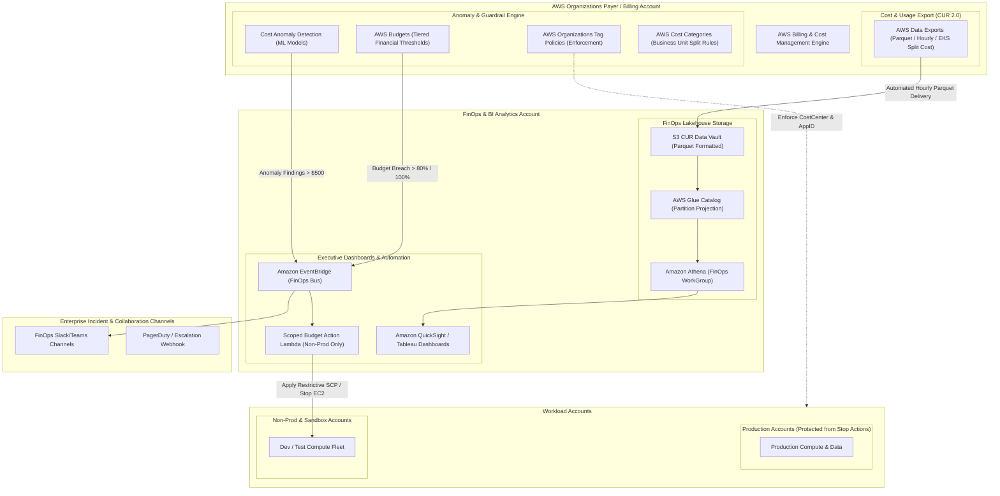

# Domain 5: FinOps & Cost Governance

## 1. Capability Scope & Service Taxonomy

### 1.1 Primary Purpose & Domain Boundaries
The FinOps & Cost Governance domain provides automated cost attribution, real-time anomaly detection, budget guardrails, unit-economic reporting, and lifecycle optimization across all business units and AWS accounts. It translates raw cloud infrastructure spend into actionable business metrics (e.g., cost per customer transaction, cost per tenant).

The domain boundary encapsulates:
- **Enterprise Tag Governance & Enforcement**: AWS Organizations Tag Policies enforcing mandatory cost allocation tags (`CostCenter`, `Environment`, `Owner`, `ApplicationID`, `BusinessUnit`) paired with automated SCPs that deny non-compliant resource creation.
- **Cost & Usage Data Pipeline (CUR 2.0 / Data Exports)**: AWS Cost and Usage Report 2.0 (CUR) delivery into Parquet format with AWS Glue Partition Projection and sub-second Amazon Athena queries.
- **Hierarchical Cost Allocation & Taxonomy**: AWS Cost Categories organizing accounts, tags, and chargeback models into structured business hierarchies (e.g., Platform Engineering, Digital Banking, Customer Success).
- **Proactive Budgeting & Scoped Guardrail Controls**: AWS Budgets with programmatic notifications and auto-enforcing AWS Budgets Actions strictly scoped to non-production/sandbox environments.
- **AI-Powered Anomaly Detection**: AWS Cost Anomaly Detection with root-cause analysis models sending alerts to engineering leads via SNS/EventBridge.

### 1.2 Core AWS Services & Modern Capabilities
- **AWS Cost and Usage Report 2.0 (AWS Data Exports)**: Native Apache Parquet export with sub-hourly granularity and split cost allocation data for Amazon EKS container workloads.
- **AWS Glue Data Catalog with Partition Projection**: Eliminates metadata scan overhead on multi-year CUR Athena datasets.
- **AWS Cost Categories**: Multi-dimensional rule-based categorization handling shared cost splits (e.g., allocating 20% of Transit Gateway spend to Business Unit A, 80% to Business Unit B).
- **AWS Cost Anomaly Detection**: Machine learning evaluations detecting unexpected spend spikes with root-cause identification down to account, service, and region.
- **AWS Budgets & Budget Actions**: Automated financial threshold alarms with scoped enforcement on dev/sandbox accounts.
- **AWS Organizations Tag Policies**: Organization-wide tag spelling and case-sensitivity enforcement.

---

## 2. IaC Repository Boundary & Inter-Module Contracts

### 2.1 Dedicated Repository Naming & Layout
- **Repository Name**: `terraform-aws-finops-cost-governance`
- **Engine**: Terraform >= 1.9.0 with AWS Provider >= 5.60.0

```
terraform-aws-finops-cost-governance/
├── .github/
│   └── workflows/
│       ├── lint-validate.yml
│       └── tag-compliance-check.yml
├── config/
│   ├── tag-policies.tfvars
│   ├── cost-categories.tfvars
│   └── budget-thresholds.tfvars
├── modules/
│   ├── tag-policies-org/
│   │   ├── main.tf
│   │   ├── policy_definitions.tf
│   │   ├── org_attachments.tf
│   │   └── outputs.tf
│   ├── cur-data-export-pipeline/
│   │   ├── data_exports.tf
│   │   ├── s3_cur_vault.tf
│   │   ├── glue_partition_projection.tf
│   │   ├── athena_workgroup.tf
│   │   └── outputs.tf
│   ├── cost-categories-baseline/
│   │   ├── main.tf
│   │   ├── business_units.tf
│   │   ├── shared_cost_rules.tf
│   │   └── outputs.tf
│   ├── cost-anomaly-detection/
│   │   ├── anomaly_monitors.tf
│   │   ├── anomaly_subscriptions.tf
│   │   └── outputs.tf
│   ├── enterprise-budgets/
│   │   ├── org_budgets.tf
│   │   ├── scoped_budget_actions.tf
│   │   ├── sns_notifications.tf
│   │   └── outputs.tf
│   └── compute-optimizer-org/
│       ├── enrollment.tf
│       ├── export_s3.tf
│       └── outputs.tf
├── live/
│   ├── billing-payer-account/
│   │   ├── terragrunt.hcl
│   │   └── main.tf
│   └── finops-analytics-account/
│       ├── terragrunt.hcl
│       └── main.tf
├── tests/
│   └── cur_query_verification_test.go
├── versions.tf
└── README.md
```

### 2.2 Cross-Module Contracts & Dependencies

#### SSM Parameter Store Exports:
| Parameter Path | Type | Consumer / Scope | Purpose |
| :--- | :--- | :--- | :--- |
| `/enterprise/finops/cur/s3-bucket-arn` | String | BI / Analytics Platform | Destination S3 Bucket ARN for CUR 2.0 Parquet exports |
| `/enterprise/finops/athena/workgroup-name` | String | QuickSight / BI Dashboards | Athena WorkGroup for running FinOps chargeback queries |
| `/enterprise/finops/sns/anomaly-alert-topic-arn` | String | SRE & FinOps Notification Hub | SNS Topic ARN for real-time cost anomaly broadcasts |
| `/enterprise/finops/tags/mandatory-tag-keys` | StringList | All Terraform Workload Modules | Required tag keys validated by pre-commit hooks and CI/CD pipelines |

#### Remote State & Inter-Module Dependencies:
- **Upstream Dependencies**: Domain 1 (`terraform-aws-landing-zone-network-fabric` for Org Root), Domain 3 (`terraform-aws-central-identity-kms-security` for KMS CMKs).
- **Downstream Consumers**: All Workload Domains (6 through 10) to inherit standardized cost allocation tags and EKS split-cost allocation rules.

---

## 3. Architecture Topology Diagram



---

## 4. Expert Architectural Review & Trade-off Critique

### 4.1 Well-Architected Assessment
- **Security**:
  - *Data Isolation*: Financial and billing analytics data resides in a dedicated FinOps Analytics account, decoupled from the Management/Payer account.
  - *Scoped Action Guardrail*: Budget action automation is strictly isolated to Dev/Sandbox OUs, eliminating operational risks to Production.
- **Reliability**:
  - *Athena Partition Projection*: Eliminates Glue metadata scan bottlenecks, guaranteeing sub-second queries across years of historical CUR data.
  - *Decoupled Anomaly Alerting*: Multi-channel alerting (EventBridge -> SNS -> Slack/PagerDuty) guarantees delivery.
- **Operational Excellence**:
  - *EKS Split-Cost Allocation*: Surfaces container CPU and memory consumption attributed to specific Kubernetes namespaces and labels directly in the CUR.
- **Cost Optimization**:
  - *Athena Query Optimization*: CUR Parquet datasets partitioned with Projection reduce Athena query scan volumes by over 90%.

### 4.2 Critical Architectural Risks & Mitigations

#### Risk 1: Athena Full-Bucket Scan Cost Runaway on Historical CUR Data
- **Failure Mechanism**: BI analysts querying historical billing records trigger multi-terabyte unpartitioned scans, accumulating unexpected Athena query charges.
- **Mitigation Strategy**:
  1. Enforce AWS Glue Partition Projection on `year` and `month` in the Athena Data Catalog table.
  2. Implement an Athena WorkGroup query data cap (e.g., maximum 50GB scanned per query).

#### Risk 2: FinOps Chargeback Distortion via Missing or Non-Standard Tags
- **Failure Mechanism**: Spoke teams provision infrastructure with tag variations (`cost_center` vs `CostCenter`), misallocating shared platform costs.
- **Mitigation Strategy**:
  1. Implement AWS Organizations Tag Policies with strict case enforcement.
  2. Configure AWS Cost Categories with regex normalization rules.
