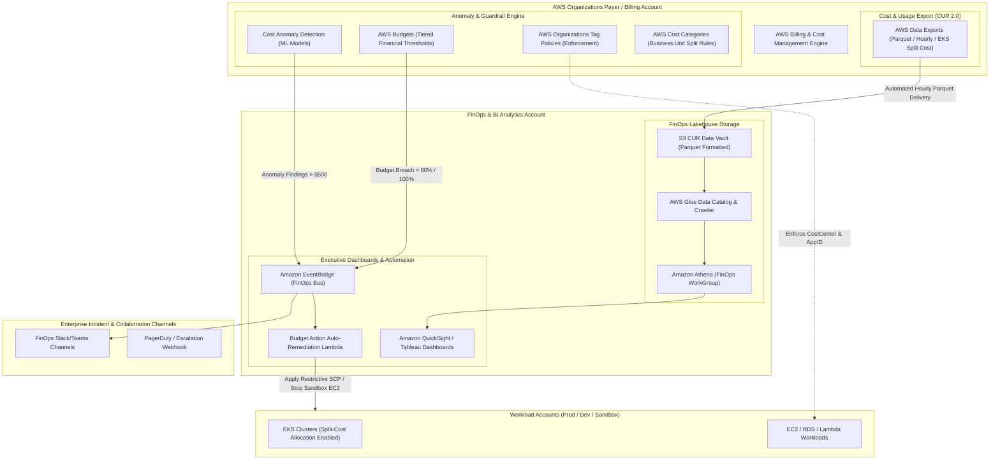

# Domain 5: FinOps & Cost Governance

## 1. Capability Scope & Service Taxonomy

### 1.1 Primary Purpose & Domain Boundaries
The FinOps & Cost Governance domain provides automated cost attribution, real-time anomaly detection, budget guardrails, unit-economic reporting, and lifecycle optimization across all business units and AWS accounts. It translates raw cloud infrastructure spend into actionable business metrics (e.g., cost per customer transaction, cost per tenant).

The domain boundary encapsulates:
- **Enterprise Tag Governance & Enforcement**: AWS Organizations Tag Policies enforcing mandatory cost allocation tags (`CostCenter`, `Environment`, `Owner`, `ApplicationID`, `BusinessUnit`) paired with automated SCPs that deny non-compliant resource creation.
- **Cost & Usage Data Pipeline (CUR 2.0 / Data Exports)**: AWS Cost and Usage Report 2.0 (CUR) delivery into Parquet format in an S3 Data Analytics bucket, transformed via AWS Glue and queryable via Amazon Athena.
- **Hierarchical Cost Allocation & Taxonomy**: AWS Cost Categories organizing accounts, tags, and chargeback models into structured business hierarchies (e.g., Platform Engineering, Digital Banking, Customer Success).
- **Proactive Budgeting & Guardrail Controls**: AWS Budgets with programmatic notifications to Slack/Teams and auto-enforcing AWS Budgets Actions (e.g., applying restrictive SCPs or revoking IAM rights on test accounts when thresholds exceed 100%).
- **AI-Powered Anomaly Detection**: AWS Cost Anomaly Detection with root-cause analysis models sending alerts to engineering leads via SNS/EventBridge.

### 1.2 Core AWS Services & Modern Capabilities
- **AWS Cost and Usage Report 2.0 (AWS Data Exports)**: Native Apache Parquet export with sub-hourly granularity and split cost allocation data for Amazon EKS container workloads.
- **AWS Cost Categories**: Multi-dimensional rule-based categorization handling shared cost splits (e.g., allocating 20% of Transit Gateway spend to Business Unit A, 80% to Business Unit B).
- **AWS Cost Anomaly Detection**: Machine learning evaluations detecting unexpected spend spikes with root-cause identification down to account, service, and region.
- **AWS Budgets & Budget Actions**: Automated financial threshold alarms with target action integration (IAM policy attachment, EC2 stop, SCP application).
- **AWS Organizations Tag Policies**: Organization-wide tag spelling and case-sensitivity enforcement.
- **AWS Compute Optimizer & Rightsizing Pipelines**: ML-driven right-sizing recommendations for EC2, EBS, Lambda, and ECS/EKS tasks.

---

## 2. IaC Repository Boundary & Inter-Module Contracts

### 2.1 Dedicated Repository Naming & Layout
- **Repository Name**: `terraform-aws-finops-cost-governance`
- **Engine**: Terraform >= 1.9.0 with AWS Provider >= 5.60.0

```
terraform-aws-finops-cost-governance/
├── .github/
│   └── workflows/
│       ├── lint-validate.yml
│       └── tag-compliance-check.yml
├── config/
│   ├── tag-policies.tfvars
│   ├── cost-categories.tfvars
│   └── budget-thresholds.tfvars
├── modules/
│   ├── tag-policies-org/
│   │   ├── main.tf
│   │   ├── policy_definitions.tf
│   │   ├── org_attachments.tf
│   │   └── outputs.tf
│   ├── cur-data-export-pipeline/
│   │   ├── data_exports.tf
│   │   ├── s3_cur_vault.tf
│   │   ├── glue_crawler.tf
│   │   ├── athena_workgroup.tf
│   │   └── outputs.tf
│   ├── cost-categories-baseline/
│   │   ├── main.tf
│   │   ├── business_units.tf
│   │   ├── shared_cost_rules.tf
│   │   └── outputs.tf
│   ├── cost-anomaly-detection/
│   │   ├── anomaly_monitors.tf
│   │   ├── anomaly_subscriptions.tf
│   │   └── outputs.tf
│   ├── enterprise-budgets/
│   │   ├── org_budgets.tf
│   │   ├── budget_actions.tf
│   │   ├── sns_notifications.tf
│   │   └── outputs.tf
│   └── compute-optimizer-org/
│       ├── enrollment.tf
│       ├── export_s3.tf
│       └── outputs.tf
├── live/
│   ├── billing-payer-account/
│   │   ├── terragrunt.hcl
│   │   └── main.tf
│   └── finops-analytics-account/
│       ├── terragrunt.hcl
│       └── main.tf
├── tests/
│   └── cur_query_verification_test.go
├── versions.tf
└── README.md
```

### 2.2 Cross-Module Contracts & Dependencies

#### SSM Parameter Store Exports:
| Parameter Path | Type | Consumer / Scope | Purpose |
| :--- | :--- | :--- | :--- |
| `/enterprise/finops/cur/s3-bucket-arn` | String | BI / Analytics Platform | Destination S3 Bucket ARN for CUR 2.0 Parquet exports |
| `/enterprise/finops/athena/workgroup-name` | String | QuickSight / BI Dashboards | Athena WorkGroup for running FinOps chargeback queries |
| `/enterprise/finops/sns/anomaly-alert-topic-arn` | String | SRE & FinOps Notification Hub | SNS Topic ARN for real-time cost anomaly broadcasts |
| `/enterprise/finops/tags/mandatory-tag-keys` | StringList | All Terraform Workload Modules | Required tag keys validated by pre-commit hooks and CI/CD pipelines |

#### Remote State & Inter-Module Dependencies:
- **Upstream Dependencies**: Domain 1 (`terraform-aws-landing-zone-network-fabric` for Org Root), Domain 3 (`terraform-aws-central-identity-kms-security` for KMS CMKs).
- **Downstream Consumers**: All Workload Domains (6 through 10) to inherit standardized cost allocation tags and EKS split-cost allocation rules.

#### IAM Baseline Assumptions:
- `AWSAccelerator-FinOpsAdminRole` with permissions to configure AWS Data Exports, Cost Categories, Budgets, and Glue Data Catalogs in the Payer Account.
- S3 Bucket Policy grants `billingreports.amazonaws.com` write access with server-side KMS encryption.

---

## 3. Architecture Topology Diagram



---

## 4. Expert Architectural Review & Trade-off Critique

### 4.1 Well-Architected Assessment
- **Security**:
  - *Data Isolation*: Financial and billing analytics data resides in a dedicated FinOps Analytics account, decoupled from the Management/Payer account, adhering to least privilege.
  - *Restricted Athena Access*: Data analyst IAM roles are constrained via row-level and column-level security in Amazon QuickSight / Athena Lake Formation permissions.
- **Reliability**:
  - *Automated CUR 2.0 Ingestion*: Direct Apache Parquet export eliminates brittle Python/Lambda unzipping scripts and CSV-to-Parquet conversion pipelines, ensuring 99.99% data pipeline reliability.
  - *Decoupled Anomaly Alerting*: Multi-channel alerting (EventBridge -> SNS -> Slack/PagerDuty) guarantees notifications survive endpoint failures.
- **Operational Excellence**:
  - *EKS Split-Cost Allocation*: Native split cost data surfaces pod-level CPU and memory consumption attributed to specific Kubernetes namespaces and labels directly in the CUR.
  - *Automated Tag Remediation*: Pre-commit hooks in IaC repositories combine with AWS Config rules to flag untagged resources within 5 minutes of creation.
- **Cost Optimization**:
  - *Athena Query Partitioning*: CUR Parquet datasets partitioned by `year`, `month`, and `account_id` reduce Athena query scan volumes by over 90%, slashing ad-hoc query costs.
  - *Commitment Strategy*: AWS Cost Anomaly Detection monitors Savings Plans and Reserved Instance coverage/utilization, alerting before commitment expirations occur.

### 4.2 Critical Architectural Risks & Mitigations

#### Risk 1: Uncontrolled Serverless / AI Inference Cost Runaway
- **Failure Mechanism**: A recursive Lambda invocation bug or unthrottled Bedrock model inference endpoint generates millions of requests over a weekend, racking up tens of thousands of dollars before standard daily billing summaries reflect the surge.
- **Mitigation Strategy**:
  1. Deploy AWS Cost Anomaly Detection with a low threshold ($100 - $500 impact) linked directly to high-priority PagerDuty / Slack webhooks.
  2. Implement concurrency limits on AWS Lambda (`ReservedConcurrentExecutions`) and strict AWS Bedrock usage quotas / Application Load Balancer rate limiting.

#### Risk 2: FinOps Chargeback Distortion via Missing or Non-Standard Tags
- **Failure Mechanism**: Spoke teams provision infrastructure with slight tag variations (`cost_center` vs `CostCenter` vs `cost-center`), causing shared platform costs to fall into unallocated buckets and distorting financial unit-economics.
- **Mitigation Strategy**:
  1. Implement AWS Organizations Tag Policies with strict case enforcement.
  2. Configure AWS Cost Categories with regex normalization rules to aggregate historical variations while Terraform pipelines enforce exact casing on all new commits.
