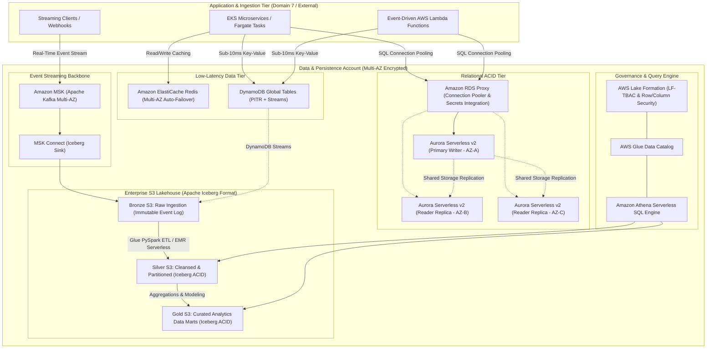

# Domain 6: Data Persistence, Streaming & Lakehouse Foundations

## 1. Capability Scope & Service Taxonomy

### 1.1 Primary Purpose & Domain Boundaries
The Data Persistence, Streaming & Lakehouse Foundations domain establishes the core multi-model database tier, real-time event streaming pipelines, and unified lakehouse architecture. It delivers sub-millisecond key-value caching, relational transactional ACID consistency, petabyte-scale analytical query engines, and centralized data governance.

The domain boundary encapsulates:
- **Relational OLTP & Global Data Stores**: Amazon Aurora Serverless v2 (PostgreSQL / MySQL) with Multi-AZ clusters, Aurora Global Database for cross-region disaster recovery, and RDS Proxy for connection pooling.
- **Ultra-Low Latency NoSQL & In-Memory Caching**: Amazon DynamoDB with Global Tables (active-active multi-region), Point-In-Time Recovery (PITR), and Amazon ElastiCache for Redis / Dragonfly / MemoryDB for distributed microservice session and query caching.
- **Real-Time Streaming Ingestion**: Amazon Managed Streaming for Apache Kafka (MSK Serverless / Provisioned) and Amazon Kinesis Data Streams with partition key hashing and auto-scaling.
- **Lakehouse Foundation & Modern Storage Formats**: Amazon S3 Data Lake structured in Medallion Architecture (Bronze: Raw, Silver: Cleansed, Gold: Aggregated) leveraging open table formats (Apache Iceberg / Delta Lake).
- **Data Cataloging & Governance**: AWS Glue Data Catalog, AWS Lake Formation (fine-grained table, column, and row-level access controls), and Amazon Athena Serverless for SQL analytics.

### 1.2 Core AWS Services & Modern Capabilities
- **Amazon Aurora Serverless v2**: Instant scaling in fine-grained Aurora Capacity Units (ACUs from 0.5 to 128 ACU) with zero connection drops.
- **Amazon DynamoDB (Global Tables & PITR)**: Multi-region active-active replication with sub-second replication latency and continuous backups.
- **Amazon RDS Proxy & Aurora Connection Pooling**: Serverless connection multiplexing shielding databases from Lambda/container scale surges.
- **Amazon MSK (Apache Kafka) & MSK Connect**: Managed Kafka with Tiered Storage (S3 backing), IAM authentication, and schema registry.
- **AWS Lake Formation**: Tag-based access control (LF-TBAC), data filtering, and centralized cross-account sharing via AWS RAM.
- **Apache Iceberg on AWS S3 & Glue**: ACID transactions, schema evolution, partition evolution, and time-travel querying on Amazon S3 data lakes.

---

## 2. IaC Repository Boundary & Inter-Module Contracts

### 2.1 Dedicated Repository Naming & Layout
- **Repository Name**: `terraform-aws-data-persistence-lakehouse`
- **Engine**: Terraform >= 1.9.0 with AWS Provider >= 5.60.0

```
terraform-aws-data-persistence-lakehouse/
├── .github/
│   └── workflows/
│       ├── lint-validate.yml
│       └── schema-contract-test.yml
├── config/
│   ├── aurora-postgresql.tfvars
│   ├── dynamodb-tables.tfvars
│   ├── msk-streaming.tfvars
│   └── lakehouse-medallion.tfvars
├── modules/
│   ├── aurora-serverless-v2/
│   │   ├── main.tf
│   │   ├── cluster_parameter_groups.tf
│   │   ├── rds_proxy.tf
│   │   ├── auto_scaling.tf
│   │   └── outputs.tf
│   ├── dynamodb-global-tables/
│   │   ├── main.tf
│   │   ├── replica_regions.tf
│   │   ├── autoscaling.tf
│   │   └── outputs.tf
│   ├── elasticache-redis-cluster/
│   │   ├── main.tf
│   │   ├── replication_groups.tf
│   │   ├── subnet_groups.tf
│   │   └── outputs.tf
│   ├── msk-kafka-cluster/
│   │   ├── main.tf
│   │   ├── serverless_msk.tf
│   │   ├── client_auth.tf
│   │   ├── schema_registry.tf
│   │   └── outputs.tf
│   ├── s3-lakehouse-medallion/
│   │   ├── raw_bronze.tf
│   │   ├── cleansed_silver.tf
│   │   ├── analytics_gold.tf
│   │   ├── lifecycle_policies.tf
│   │   └── outputs.tf
│   └── lakeformation-governance/
│       ├── main.tf
│       ├── lf_tags.tf
│       ├── permissions.tf
│       └── outputs.tf
├── live/
│   ├── data-platform-prod/
│   │   ├── terragrunt.hcl
│   │   └── main.tf
│   └── data-platform-nonprod/
│       ├── terragrunt.hcl
│       └── main.tf
├── tests/
│   └── rds_proxy_failover_test.go
├── versions.tf
└── README.md
```

### 2.2 Cross-Module Contracts & Dependencies

#### SSM Parameter Store & Secrets Manager Exports:
| Parameter Path | Type | Consumer / Scope | Purpose |
| :--- | :--- | :--- | :--- |
| `/enterprise/data/aurora/proxy-endpoint` | String | Domain 7 (EKS / Lambda Compute) | RDS Proxy read-write connection string |
| `/enterprise/data/aurora/reader-proxy-endpoint` | String | Domain 7 (EKS / Analytics) | RDS Proxy read-only connection string |
| `/enterprise/data/dynamodb/orders-table-arn` | String | Microservice Repositories | Core transactional DynamoDB table ARN |
| `/enterprise/data/msk/bootstrap-brokers-tls` | String | Stream Processing Workloads | Kafka TLS bootstrap broker endpoints |
| `/enterprise/data/lakehouse/silver-iceberg-bucket-arn` | String | Glue ETL / Athena Analytics | Cleansed Silver Lakehouse Iceberg S3 bucket |
| `/enterprise/data/secrets/aurora-app-credentials-arn` | String (Secret) | Compute Services | Secrets Manager ARN for dynamic DB user credentials |

#### Remote State & Inter-Module Dependencies:
- **Upstream Dependencies**: Domain 1 (`terraform-aws-landing-zone-network-fabric` for Spoke Database Subnets), Domain 3 (`terraform-aws-central-identity-kms-security` for Storage CMKs).
- **Downstream Consumers**: Domain 7 (Compute/EKS application workloads), Domain 8 (EventBridge & Step Functions ETL), Domain 10 (SageMaker ML Training/Inference), Domain 11 (Cross-Region DR).

#### IAM Baseline Assumptions:
- IAM Database Authentication enabled on Aurora clusters (`rds-db:connect`).
- MSK cluster strictly requires IAM Access Control (`kafka-cluster:Connect`, `kafka-cluster:DescribeTopic`).

---

## 3. Architecture Topology Diagram



---

## 4. Expert Architectural Review & Trade-off Critique

### 4.1 Well-Architected Assessment
- **Security**:
  - *Zero Public Accessibility*: All databases, caches, and MSK brokers reside exclusively in isolated database subnets without internet routes.
  - *Lake Formation Fine-Grained Security*: Replaces broad S3 bucket policies with Tag-Based Access Control (LF-TBAC), dynamically masking PII columns (e.g., SSN, credit cards) based on caller IAM roles.
- **Reliability**:
  - *Aurora Storage Layer Resilience*: 6-way storage replication across 3 AZs; survives loss of an entire AZ plus an additional disk without read/write downtime.
  - *DynamoDB Global Tables Multi-Region Active-Active*: Instant failover capability with automated conflict resolution based on timestamp ordering.
- **Operational Excellence**:
  - *Aurora Serverless v2 Dynamic Scaling*: Automatically scales compute up/down in 0.5 ACU increments in fractions of a second in response to application traffic, eliminating capacity planning guesswork.
  - *Apache Iceberg Schema Evolution*: Enables non-breaking column additions, renames, and type promotions without full table rewrites.
- **Cost Optimization**:
  - *RDS Proxy Resource Optimization*: Reduces database connection memory overhead by multiplexing 10,000 application connections into 200 persistent backend connections.
  - *MSK Tiered Storage*: Offloads aged Kafka topic partitions (> 24 hours) from high-cost EBS gp3 storage to low-cost Amazon S3, cutting streaming storage costs by 65%.

### 4.2 Critical Architectural Risks & Mitigations

#### Risk 1: DynamoDB Partition Hotspotting & Read/Write Throttling
- **Failure Mechanism**: Poorly chosen partition keys (e.g., ordering by `date` or single tenant ID) steer massive write traffic to a single DynamoDB partition, exceeding the 1,000 WCU / 3,000 RCU per partition limit and triggering `ProvisionedThroughputExceededException`.
- **Mitigation Strategy**:
  1. Implement synthetic partition key salting (e.g., `PartitionKey = TenantID + "_" + RandomHash(1..10)`).
  2. Front high-frequency read keys with Amazon ElastiCache Redis or DynamoDB Accelerator (DAX) with write-through caching.

#### Risk 2: Apache Iceberg Small-File Problem in Streaming S3 Lakehouse
- **Failure Mechanism**: High-frequency streaming writes from MSK Connect into S3 create millions of tiny 1MB Parquet files, degrading Athena query execution times from seconds to minutes due to S3 GET latency overhead.
- **Mitigation Strategy**:
  1. Schedule automated AWS Glue Iceberg compaction jobs (`CALL system.rewrite_data_files()`) to bin-pack small files into 512MB optimized chunks.
  2. Implement automated snapshot expiration and orphan file removal in Lake Formation to prevent S3 metadata bloat.
