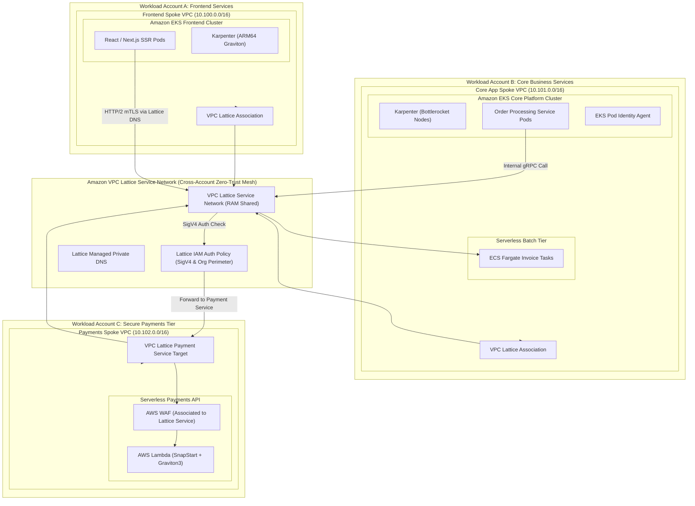

# Domain 7: Compute & Container Platforms

## 1. Capability Scope & Service Taxonomy

### 1.1 Primary Purpose & Domain Boundaries
The Compute & Container Platforms domain provides resilient, scalable, and secure application execution runtimes across containerized (EKS, ECS Fargate), serverless (AWS Lambda), and modern service networking (Amazon VPC Lattice) architectures. It standardizes node lifecycle management, GitOps deployments, pod identity federation, and zero-trust service-to-service communication across VPCs and accounts.

The domain boundary encapsulates:
- **Kubernetes Enterprise Fabric (Amazon EKS)**: EKS Managed Control Plane, Karpenter autoscaling on EC2 Graviton/AMD instances, Bottlerocket OS for immutable container hosts, EKS Pod Identity (EKS Pod Identity Agent) replacing IRSA, and GitOps delivery (ArgoCD / Flux).
- **Serverless Containers (Amazon ECS Fargate)**: Ephemeral, zero-maintenance container execution with ECS Exec debugging disabled in production, AWS Copilot / ECS Service Connect for internal discovery.
- **Serverless Event Runtimes (AWS Lambda)**: ARM64 (Graviton3) optimized functions, Lambda SnapStart (Java/Python) for sub-second cold starts, VPC dual-stack integration, and Lambda Function URLs with AWS IAM authentication.
- **Modern Service Networking & Zero-Trust Mesh (Amazon VPC Lattice)**: Cross-VPC, cross-account service networking with built-in Layer 7 routing, mutual TLS (mTLS), IAM auth policies, and automated Route 53 private DNS integration without requiring complex TGW route tables.

### 1.2 Core AWS Services & Modern Capabilities
- **Amazon EKS & Karpenter**: Just-in-time node provisioning with multi-architecture blending (ARM64/x86_64, Spot/On-Demand) and consolidation.
- **Amazon VPC Lattice**: Cross-account service mesh and Layer 7 gateway with fine-grained IAM authentication and AWS WAF association.
- **EKS Pod Identity**: Native AWS IAM credential vending directly to Kubernetes Service Accounts without OIDC trust policy bloat.
- **Bottlerocket OS**: Security-hardened Linux distribution with read-only root filesystems and dm-verity kernel integrity checking.
- **AWS Lambda SnapStart & Graviton3**: High-performance serverless execution with instant snapshot restoration.
- **AWS Secrets Store CSI Driver**: Dynamic secret mounting from AWS Secrets Manager directly into Kubernetes pod volumes.

---

## 2. IaC Repository Boundary & Inter-Module Contracts

### 2.1 Dedicated Repository Naming & Layout
- **Repository Name**: `terraform-aws-compute-container-platforms`
- **Engine**: Terraform >= 1.9.0 with AWS Provider >= 5.60.0 & Helm/Kubernetes Providers

```
terraform-aws-compute-container-platforms/
├── .github/
│   └── workflows/
│       ├── lint-validate.yml
│       └── eks-cluster-test.yml
├── config/
│   ├── eks-prod-cluster.tfvars
│   ├── ecs-fargate-services.tfvars
│   └── vpc-lattice-network.tfvars
├── modules/
│   ├── eks-enterprise-cluster/
│   │   ├── main.tf
│   │   ├── control_plane.tf
│   │   ├── pod_identity.tf
│   │   ├── karpenter.tf
│   │   ├── bottlerocket_nodepool.tf
│   │   ├── core_addons.tf
│   │   └── outputs.tf
│   ├── vpc-lattice-service-network/
│   │   ├── service_network.tf
│   │   ├── ram_sharing.tf
│   │   ├── services.tf
│   │   ├── auth_policies.tf
│   │   └── outputs.tf
│   ├── ecs-fargate-cluster/
│   │   ├── main.tf
│   │   ├── capacity_providers.tf
│   │   ├── task_definitions.tf
│   │   └── outputs.tf
│   ├── lambda-baseline-runtime/
│   │   ├── main.tf
│   │   ├── snapstart.tf
│   │   ├── vpc_config.tf
│   │   └── outputs.tf
│   └── gitops-argocd-bootstrap/
│       ├── helm_release.tf
│       ├── app_of_apps.yaml
│       └── outputs.tf
├── live/
│   ├── compute-prod-us-east-1/
│   │   ├── terragrunt.hcl
│   │   └── main.tf
│   └── compute-nonprod-us-east-1/
│       ├── terragrunt.hcl
│       └── main.tf
├── tests/
│   └── lattice_auth_test.go
├── versions.tf
└── README.md
```

### 2.2 Cross-Module Contracts & Dependencies

#### SSM Parameter Store Exports:
| Parameter Path | Type | Consumer / Scope | Purpose |
| :--- | :--- | :--- | :--- |
| `/enterprise/compute/eks/cluster-endpoint` | String | CI/CD & GitOps | EKS Kubernetes API endpoint URL |
| `/enterprise/compute/eks/oidc-issuer` | String | Kubernetes IAM integrations | EKS OIDC issuer URL |
| `/enterprise/compute/lattice/service-network-arn` | String | All Spoke Workload Accounts | VPC Lattice Service Network ARN for service association |
| `/enterprise/compute/lattice/payment-service-dns` | String | Checkout & Billing Services | Lattice-managed private domain name for internal microservice |
| `/enterprise/compute/ecs/shared-cluster-id` | String | Fargate Task Deployers | ECS Cluster ID for lightweight microservices |

#### Remote State & Inter-Module Dependencies:
- **Upstream Dependencies**: Domain 1 (`terraform-aws-landing-zone-network-fabric` for Spoke App Subnets), Domain 3 (`terraform-aws-central-identity-kms-security` for Pod Identity Roles & KMS CMKs), Domain 4 (ADOT collectors & OpenSearch log streaming).
- **Downstream Consumers**: Domain 6 (Database access via RDS Proxy), Domain 8 (EventBridge publishers/consumers), Domain 10 (Bedrock GenAI integrations).

#### IAM Baseline Assumptions:
- `EKS-Pod-Identity-Agent` installed on all EKS clusters.
- VPC Lattice Auth Policy enforces `aws:PrincipalOrgID` matching the enterprise organization ID on all service network ingress endpoints.

---

## 3. Architecture Topology Diagram



---

## 4. Expert Architectural Review & Trade-off Critique

### 4.1 Well-Architected Assessment
- **Security**:
  - *Zero-Trust Service Networking*: Amazon VPC Lattice enforces Layer 7 AWS Signature Version 4 (SigV4) IAM authorization on every individual microservice call, eliminating reliance on perimeter IP-based security groups.
  - *Immutable Host Operating System*: Bottlerocket OS prevents attackers from persisting rootkits or shell modifications on EKS worker nodes; eliminates SSH daemons completely.
- **Reliability**:
  - *Karpenter Fast Scaling*: Provisions right-sized EC2 instances in under 45 seconds (compared to 3-5 minutes with legacy Cluster Autoscaler), reacting instantaneously to traffic spikes.
  - *Multi-AZ Pod Topology Spread*: Enforces Kubernetes `topologySpreadConstraints` across 3 AZs to survive single Availability Zone outages without application degradation.
- **Operational Excellence**:
  - *EKS Pod Identity Migration*: Eliminates complex IAM OIDC Role Trust relationships with 1,000+ character policy size limits, streamlining IAM permission management for Kubernetes namespaces.
  - *GitOps Driven Configuration*: 100% of Kubernetes cluster manifests and Helm charts are continuously synchronized from Git repositories using ArgoCD.
- **Cost Optimization**:
  - *Graviton3 / ARM64 Workload Modernization*: Transitioning container workloads to ARM64 Graviton instances delivers up to 40% better price-performance compared to comparable x86 instances.
  - *VPC Lattice vs TGW Data Charges*: VPC Lattice bypasses TGW data processing charges for East-West service communication across accounts while providing native HTTP/2 and gRPC path-based routing.

### 4.2 Critical Architectural Risks & Mitigations

#### Risk 1: Karpenter Spot Instance Eviction Storm
- **Failure Mechanism**: A sudden AWS EC2 Spot capacity reclamation wave terminates 50%+ of Karpenter-provisioned worker nodes simultaneously, causing pod rescheduling bottlenecks, resource starvation, and cascading service outages.
- **Mitigation Strategy**:
  1. Configure Karpenter `NodePool` to blend Spot and On-Demand instances (e.g., base capacity 30% On-Demand, variable capacity Spot).
  2. Diversify instance types across at least 15 distinct instance families (e.g., `c6g.xlarge`, `c7g.xlarge`, `m6g.xlarge`, `m7g.xlarge`) and listen to AWS Node Termination Handler / EC2 Spot Interruption notices (2-minute warning) for graceful pod draining.

#### Risk 2: VPC Lattice IAM Authorization Policy Misconfiguration
- **Failure Mechanism**: An engineer applies an overly broad `Deny` condition or malformed SigV4 IAM Auth Policy on the VPC Lattice Service Network, immediately blackholing cross-account inter-service communication across all microservices.
- **Mitigation Strategy**:
  1. Enforce automated policy simulation testing using IAM Policy Simulator in CI/CD before applying Lattice Auth Policies.
  2. Implement staged rollouts: Deploy new Lattice service routes in `Audit` mode or alongside secondary target groups before updating production routing rules.
