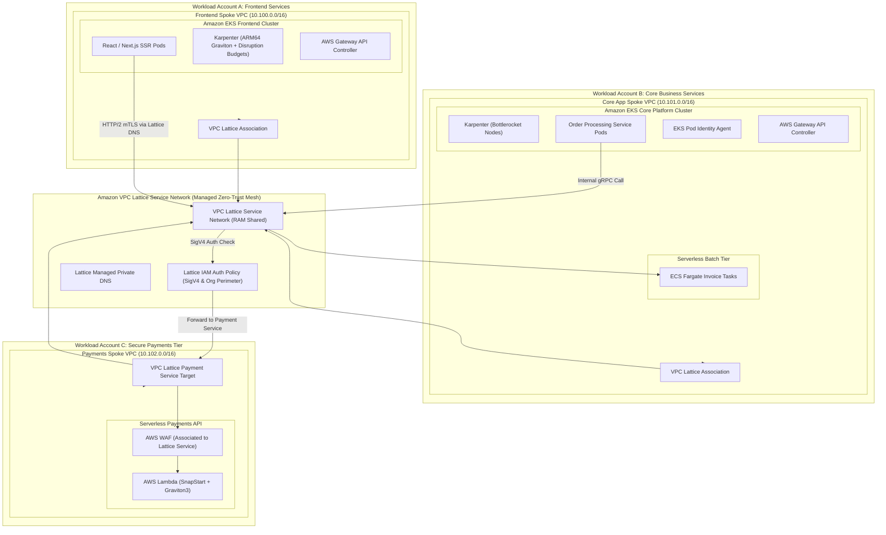

# Domain 7: Compute & Container Platforms

## 1. Capability Scope & Service Taxonomy

### 1.1 Primary Purpose & Domain Boundaries
The Compute & Container Platforms domain provides resilient, scalable, and secure application execution runtimes across containerized (EKS, ECS Fargate), serverless (AWS Lambda), and modern service networking (Amazon VPC Lattice) architectures. It standardizes node lifecycle management, GitOps deployments, pod identity federation, and zero-trust service-to-service communication across VPCs and accounts.

The domain boundary encapsulates:
- **Kubernetes Enterprise Fabric (Amazon EKS)**: EKS Managed Control Plane, Karpenter autoscaling on EC2 Graviton/AMD instances with strict disruption budgets, Bottlerocket OS for immutable container hosts, EKS Pod Identity (EKS Pod Identity Agent) replacing IRSA, and GitOps delivery (ArgoCD).
- **Modern Service Networking & Gateway API (Amazon VPC Lattice)**: Cross-VPC, cross-account service networking managed via the official AWS Gateway API Controller (`aws-gateway-api-controller`), mapping Kubernetes HTTPRoute resources directly into VPC Lattice Service Networks with SigV4 IAM authentication.
- **Serverless Containers (Amazon ECS Fargate)**: Ephemeral, zero-maintenance container execution with ECS Exec debugging disabled in production, AWS Copilot / ECS Service Connect for internal discovery.
- **Serverless Event Runtimes (AWS Lambda)**: ARM64 (Graviton3) optimized functions, Lambda SnapStart for sub-second cold starts, and VPC dual-stack integration.

### 1.2 Core AWS Services & Modern Capabilities
- **Amazon EKS & Karpenter**: Just-in-time node provisioning with multi-architecture blending (ARM64/x86_64, Spot/On-Demand) and `disruption.budgets`.
- **Amazon VPC Lattice & AWS Gateway API Controller**: Native Kubernetes Gateway API mapping to VPC Lattice Layer 7 zero-trust meshes.
- **EKS Pod Identity**: Native AWS IAM credential vending directly to Kubernetes Service Accounts.
- **Bottlerocket OS**: Security-hardened Linux distribution with read-only root filesystems and dm-verity kernel integrity.
- **AWS Lambda SnapStart & Graviton3**: High-performance serverless execution with instant snapshot restoration.

---

## 2. IaC Repository Boundary & Inter-Module Contracts

### 2.1 Dedicated Repository Naming & Layout
- **Repository Name**: `terraform-aws-compute-container-platforms`
- **Engine**: Terraform >= 1.9.0 with AWS Provider >= 5.60.0 & Helm/Kubernetes Providers

```
terraform-aws-compute-container-platforms/
├── .github/
│   └── workflows/
│       ├── lint-validate.yml
│       └── eks-cluster-test.yml
├── config/
│   ├── eks-prod-cluster.tfvars
│   ├── ecs-fargate-services.tfvars
│   └── vpc-lattice-network.tfvars
├── modules/
│   ├── eks-enterprise-cluster/
│   │   ├── main.tf
│   │   ├── control_plane.tf
│   │   ├── pod_identity.tf
│   │   ├── karpenter_nodepools.tf
│   │   ├── bottlerocket_config.tf
│   │   ├── core_addons.tf
│   │   └── outputs.tf
│   ├── vpc-lattice-service-network/
│   │   ├── service_network.tf
│   │   ├── gateway_api_controller_iam.tf
│   │   ├── ram_sharing.tf
│   │   ├── services.tf
│   │   ├── auth_policies.tf
│   │   └── outputs.tf
│   ├── ecs-fargate-cluster/
│   │   ├── main.tf
│   │   ├── capacity_providers.tf
│   │   ├── task_definitions.tf
│   │   └── outputs.tf
│   ├── lambda-baseline-runtime/
│   │   ├── main.tf
│   │   ├── snapstart.tf
│   │   ├── vpc_config.tf
│   │   └── outputs.tf
│   └── gitops-argocd-bootstrap/
│       ├── helm_release.tf
│       ├── app_of_apps.yaml
│       └── outputs.tf
├── live/
│   ├── compute-prod-us-east-1/
│   │   ├── terragrunt.hcl
│   │   └── main.tf
│   └── compute-nonprod-us-east-1/
│       ├── terragrunt.hcl
│       └── main.tf
├── tests/
│   └── lattice_auth_test.go
├── versions.tf
└── README.md
```

### 2.2 Cross-Module Contracts & Dependencies

#### SSM Parameter Store Exports:
| Parameter Path | Type | Consumer / Scope | Purpose |
| :--- | :--- | :--- | :--- |
| `/enterprise/compute/eks/cluster-endpoint` | String | CI/CD & GitOps | EKS Kubernetes API endpoint URL |
| `/enterprise/compute/eks/oidc-issuer` | String | Kubernetes IAM integrations | EKS OIDC issuer URL |
| `/enterprise/compute/lattice/service-network-arn` | String | All Spoke Workload Accounts | VPC Lattice Service Network ARN for service association |
| `/enterprise/compute/lattice/gateway-api-controller-role-arn` | String | EKS Cluster Controllers | IAM Role ARN for AWS Gateway API Controller |
| `/enterprise/compute/lattice/payment-service-dns` | String | Checkout & Billing Services | Lattice-managed private domain name for internal microservice |
| `/enterprise/compute/ecs/shared-cluster-id` | String | Fargate Task Deployers | ECS Cluster ID for lightweight microservices |

#### Remote State & Inter-Module Dependencies:
- **Upstream Dependencies**: Domain 1 (`terraform-aws-landing-zone-network-fabric` for Spoke App Subnets), Domain 3 (`terraform-aws-central-identity-kms-security` for Pod Identity Roles & KMS CMKs), Domain 4 (ADOT collectors & OpenSearch log streaming).
- **Downstream Consumers**: Domain 6 (Database access via RDS Proxy), Domain 8 (EventBridge publishers/consumers), Domain 10 (Bedrock GenAI integrations).

---

## 3. Architecture Topology Diagram



---

## 4. Expert Architectural Review & Trade-off Critique

### 4.1 Well-Architected Assessment
- **Security**:
  - *Zero-Trust Service Networking*: Amazon VPC Lattice enforces Layer 7 SigV4 IAM authorization on every individual microservice call.
  - *Immutable Host Operating System*: Bottlerocket OS prevents attackers from persisting rootkits or shell modifications on EKS worker nodes.
- **Reliability**:
  - *Karpenter Disruption Budgets*: Protects application availability by limiting simultaneous node consolidations to $\le 10\%$ of cluster capacity.
  - *Multi-AZ Pod Topology Spread*: Enforces Kubernetes `topologySpreadConstraints` across 3 AZs.
- **Operational Excellence**:
  - *AWS Gateway API Controller*: Automates VPC Lattice service routing directly from Kubernetes manifests without manual AWS console configuration.
  - *EKS Pod Identity*: Eliminates complex IAM OIDC Role Trust relationships.
- **Cost Optimization**:
  - *Graviton3 / ARM64 Workload Modernization*: Delivers up to 40% better price-performance compared to comparable x86 instances.

### 4.2 Critical Architectural Risks & Mitigations

#### Risk 1: Karpenter Spot Instance Eviction Storm
- **Failure Mechanism**: A sudden Spot reclamation wave terminates multiple nodes simultaneously, causing pod rescheduling bottlenecks.
- **Mitigation Strategy**:
  1. Configure Karpenter `NodePool` with `disruption.budgets` and blend Spot (70%) with On-Demand (30%).
  2. Diversify instance types across at least 15 distinct instance families.

#### Risk 2: VPC Lattice IAM Authorization Policy Misconfiguration
- **Failure Mechanism**: An overly broad `Deny` condition on the VPC Lattice Service Network drops cross-account inter-service communication.
- **Mitigation Strategy**:
  1. Enforce automated policy simulation testing using IAM Policy Simulator in CI/CD before applying Lattice Auth Policies.
  2. Deploy new Lattice service routes in `Audit` mode prior to production enforcement.
