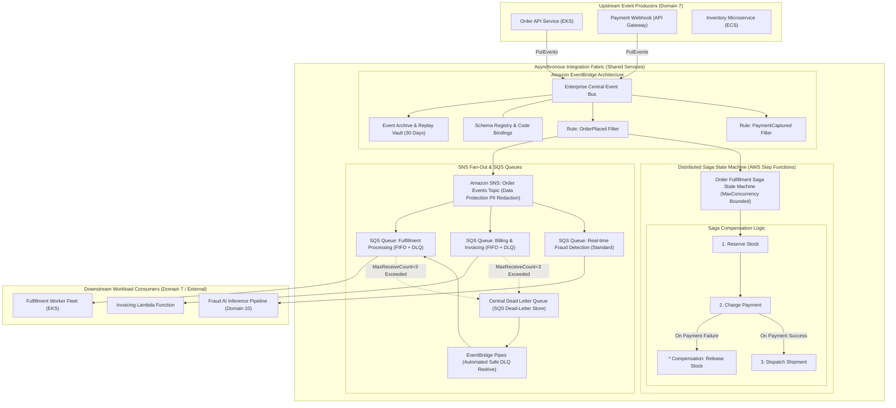

# Domain 8: Application Integration & Asynchronous Orchestration

## 1. Capability Scope & Service Taxonomy

### 1.1 Primary Purpose & Domain Boundaries
The Application Integration & Asynchronous Orchestration domain provides decoupled, event-driven messaging, enterprise workflow orchestration, and resilient publish-subscribe backbones across distributed microservices. It eliminates point-to-point synchronous coupling, absorbs traffic volatility via buffering, and guarantees transactional state machine execution.

The domain boundary encapsulates:
- **Centralized & Mesh Event Streaming (Amazon EventBridge)**: Custom Organization Event Buses, Schema Registry with automated schema discovery, content-based rule filtering, archive & replay capabilities, and cross-account event routing.
- **Enterprise Messaging & Buffering (Amazon SQS & SNS)**: Standard and FIFO Queues with Dead Letter Queues (DLQs), server-side KMS encryption, SNS Topic Fan-Out patterns, and message filtering policies.
- **Distributed Workflow State Machines (AWS Step Functions)**: Express and Standard State Machines orchestrating long-running transactional business workflows (Saga pattern) with `MaxConcurrency` controls protecting downstream databases and model APIs.
- **Point-to-Point Transformations & Automated Redrive (EventBridge Pipes)**: Seamless source-to-target streaming and automated SQS DLQ redrive pipelines.

### 1.2 Core AWS Services & Modern Capabilities
- **Amazon EventBridge (Pipes & Schema Registry)**: Point-to-point integrations and automated DLQ message redrive workflows.
- **EventBridge Event Replay & Archive**: 30-day replay window for disaster recovery and bug remediation.
- **AWS Step Functions (Distributed Map with Concurrency Governance)**: High-concurrency workflow orchestration executing parallel tasks with bounded concurrency to prevent downstream database starvation.
- **Amazon SQS FIFO & High-Throughput Mode**: Exactly-once message processing with deduplication IDs and up to 70,000 TPS.
- **Amazon SNS Message Data Protection**: Real-time inspection and redaction of PII in transit.

---

## 2. IaC Repository Boundary & Inter-Module Contracts

### 2.1 Dedicated Repository Naming & Layout
- **Repository Name**: `terraform-aws-application-integration-orchestration`
- **Engine**: Terraform >= 1.9.0 with AWS Provider >= 5.60.0

```
terraform-aws-application-integration-orchestration/
├── .github/
│   └── workflows/
│       ├── lint-validate.yml
│       └── step-functions-test.yml
├── config/
│   ├── central-event-bus.tfvars
│   ├── order-processing-workflow.tfvars
│   └── sqs-dlq-policies.tfvars
├── modules/
│   ├── eventbridge-central-bus/
│   │   ├── main.tf
│   │   ├── bus_policies.tf
│   │   ├── schema_registry.tf
│   │   ├── archives.tf
│   │   └── outputs.tf
│   ├── eventbridge-cross-account-router/
│   │   ├── rules.tf
│   │   ├── targets.tf
│   │   ├── dead_letter_queues.tf
│   │   └── outputs.tf
│   ├── sqs-sns-fanout/
│   │   ├── sns_topics.tf
│   │   ├── sqs_queues.tf
│   │   ├── subscriptions.tf
│   │   ├── data_protection_policy.tf
│   │   └── outputs.tf
│   ├── step-functions-saga/
│   │   ├── main.tf
│   │   ├── state_machine.json
│   │   ├── concurrency_limits.tf
│   │   ├── iam_roles.tf
│   │   ├── logging.tf
│   │   └── outputs.tf
│   └── eventbridge-pipes-redrive/
│       ├── main.tf
│       ├── transformations.tf
│       ├── dlq_redrive.tf
│       └── outputs.tf
├── live/
│   ├── integration-hub-prod/
│   │   ├── terragrunt.hcl
│   │   └── main.tf
│   └── integration-hub-nonprod/
│   │   ├── terragrunt.hcl
│   │   └── main.tf
├── tests/
│   └── event_routing_test.go
├── versions.tf
└── README.md
```

### 2.2 Cross-Module Contracts & Dependencies

#### SSM Parameter Store Exports:
| Parameter Path | Type | Consumer / Scope | Purpose |
| :--- | :--- | :--- | :--- |
| `/enterprise/integration/eventbridge/central-bus-arn` | String | All Microservices | Central Enterprise EventBus ARN for publishing domain events |
| `/enterprise/integration/sqs/orders-dlq-arn` | String | Order Processing Module | Shared Dead Letter Queue ARN for poisoned message capture |
| `/enterprise/integration/stepfunctions/order-saga-arn` | String | API Gateway / Compute Services | Step Functions Saga State Machine ARN |
| `/enterprise/integration/sns/billing-fanout-topic-arn` | String | Invoicing & Payment Microservices | SNS Fan-Out Topic ARN for billing event broadcast |

#### Remote State & Inter-Module Dependencies:
- **Upstream Dependencies**: Domain 3 (`terraform-aws-central-identity-kms-security` for KMS CMKs for SQS/SNS encryption), Domain 4 (Central CloudWatch Logs & X-Ray Tracing).
- **Downstream Consumers**: Domain 7 (Compute/Lambda/EKS microservice subscribers), Domain 10 (AI Pipeline Orchestration), Domain 11 (DR Event Replays).

---

## 3. Architecture Topology Diagram



---

## 4. Expert Architectural Review & Trade-off Critique

### 4.1 Well-Architected Assessment
- **Security**:
  - *SNS Message Data Protection*: Built-in pattern-matching identifiers detect and redact sensitive payment card numbers (PCI-DSS) and social security numbers before message delivery to subscriber queues.
  - *Strict SigV4 Org Bus Policies*: EventBridge buses only accept events from verified accounts within the organization.
- **Reliability**:
  - *Saga Pattern Distributed Compensation*: Coordinates distributed microservices with automated rollback and compensation actions.
  - *Automated DLQ Redrive via Pipes*: Enables zero-downtime message inspection, sanitization, and automated replay.
- **Operational Excellence**:
  - *EventBridge Replay Capabilities*: Enables instant replay of past events during bug fixes without disturbing live operational systems.
- **Cost Optimization**:
  - *EventBridge Content-Based Filtering*: Discards irrelevant events at the event bus layer before invoking expensive downstream compute.

### 4.2 Critical Architectural Risks & Mitigations

#### Risk 1: Poison Pill Messages Inducing Infinite Lambda Retry Storms
- **Failure Mechanism**: A malformed message enters an SQS queue driving a Lambda consumer. The Lambda crashes repeatedly, retrying indefinitely and exhausting concurrency pools.
- **Mitigation Strategy**:
  1. Enforce strict `maxReceiveCount = 3` on all SQS queues, routing failed payloads to a dedicated Dead Letter Queue (DLQ).
  2. Implement SQS Redrive Policy paired with EventBridge Pipes to safely redrive corrected messages.

#### Risk 2: Step Functions Distributed Map Database Starvation
- **Failure Mechanism**: Unbounded parallel tasks spawn thousands of concurrent transactions against Aurora Serverless, exhausting connection pools.
- **Mitigation Strategy**:
  1. Enforce explicit `MaxConcurrency` attributes in Step Functions Distributed Map state definitions.
  2. Integrate RDS Proxy connection queuing to absorb burst concurrency.
