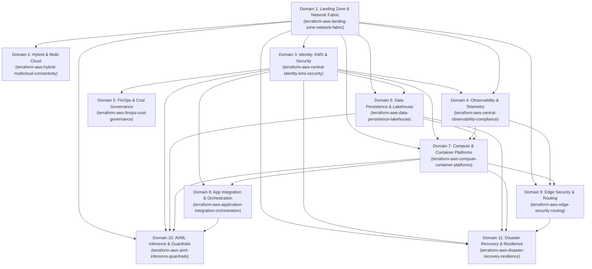

# Enterprise IaC Repository Dependency & Orchestration Matrix

## 1. End-to-End Dependency Pipeline Graph

---

## 2. IaC Execution Order & Inter-Module Dependency Table

| Execution Order | Capability Domain | IaC Repository Identifier | Direct Upstream Dependencies | Published Contract Exports |
| :---: | :--- | :--- | :--- | :--- |
| **01** | Multi-Account Landing Zone & Core Network Fabric | `terraform-aws-landing-zone-network-fabric` | AWS Organizations Root | TGW ID, Spoke RT, Inbound DNS IPs, Route 53 Profile ARN, IPAM Pools |
| **02** | Hybrid & Multi-Cloud Connectivity | `terraform-aws-hybrid-multicloud-connectivity` | Domain 01 | DXGW ID, Cloud WAN Core ID, BGP ASNs, Allowed Prefixes |
| **03** | Centralized Identity, KMS & Security Posture | `terraform-aws-central-identity-kms-security` | Domain 01 | Multi-Region KMS CMK ARNs (Primary & Replica), OIDC Roles, GuardDuty Master |
| **04** | Central Observability, Telemetry & Compliance | `terraform-aws-central-observability-compliance` | Domain 01, Domain 03 | CloudWatch OAM Sink ARN, Log Archive WORM S3 ARN, OpenSearch URL |
| **05** | FinOps & Cost Governance | `terraform-aws-finops-cost-governance` | Domain 01, Domain 03 | CUR 2.0 S3 ARN, Athena WorkGroup, Mandatory Tag Keys |
| **06** | Data Persistence, Streaming & Lakehouse | `terraform-aws-data-persistence-lakehouse` | Domain 01, Domain 03 | RDS Proxy Endpoints (RW & RO), DynamoDB ARNs, MSK Brokers, Iceberg S3 ARNs |
| **07** | Compute & Container Platforms | `terraform-aws-compute-container-platforms` | Domain 01, Domain 03, Domain 04, Domain 06 | EKS API Endpoints, VPC Lattice Service Network ARN, Gateway API Role ARN |
| **08** | Application Integration & Orchestration | `terraform-aws-application-integration-orchestration` | Domain 03, Domain 04, Domain 07 | Central EventBus ARN, SQS DLQ ARNs, Step Functions ARNs |
| **09** | Edge Security, Content Delivery & Routing | `terraform-aws-edge-security-routing` | Domain 01, Domain 04, Domain 07 | Global WAF WebACL ARN, CloudFront Distribution ID, Route 53 Zone ID |
| **10** | AI/ML Inference & Enterprise Guardrails | `terraform-aws-aiml-inference-guardrails` | Domain 01, Domain 03, Domain 06, Domain 07 | Bedrock Guardrail ID/Version, Cross-Region Inference Profile ARN, RAG KB ID |
| **11** | Disaster Recovery & Business Continuity | `terraform-aws-disaster-recovery-resilience` | Domain 01, Domain 03, Domain 06, Domain 07, Domain 09 | ARC 5-Region Cluster Endpoints, ARC Routing Control ARNs, Central Backup Vault ARN |
