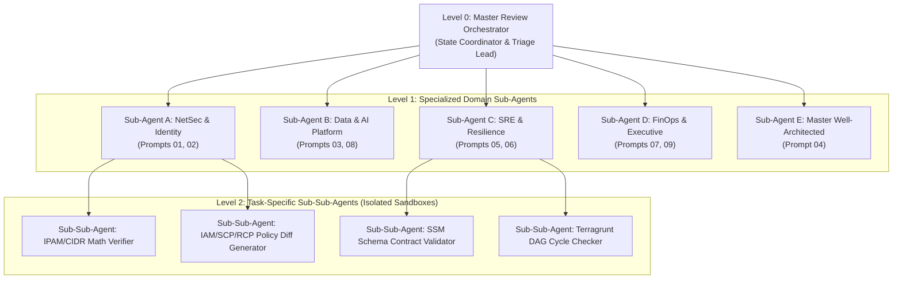
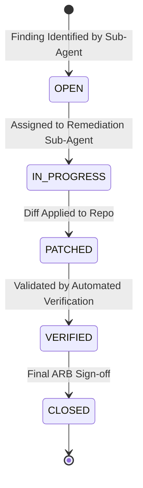
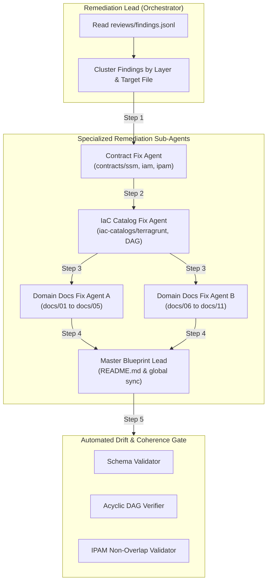

# Enterprise Architecture Review Suite & Multi-Agent Execution Work Order

This repository contains the authoritative suite of 9 specialized architecture review prompts, accompanied by a hierarchical **Multi-Agent / Sub-Agent Execution Protocol** and an end-to-end **Systematic Remediation Work Order** engineered to conduct exhaustive audits and safely apply fixes across all 11 capability domains without exceeding LLM context windows.

---

## 1. Review Prompts Catalog & Scope

| # | Review Area / Persona | Prompt File | Mandate & Primary Focus | Target Files Under Review | Output Report |
| :---: | :--- | :--- | :--- | :--- | :--- |
| **01** | **Network Architecture** | [`01-network-review-prompt.md`](01-network-review-prompt.md) | Packet flow routing, TGW route table segmentation, asymmetric firewall routing, VPC Lattice, Route 53 Profiles, IPAM sizing | `contracts/network-cidr-ipam-allocations.md`, `docs/01-*.md`, `docs/02-*.md`, `docs/09-*.md` | `reviews/reports/01-network-report.md` |
| **02** | **Zero-Trust Security & Identity** | [`02-zero-trust-security-review-prompt.md`](02-zero-trust-security-review-prompt.md) | IAM permission boundaries, SCPs/RCPs, GitHub Actions OIDC federation, KMS key policies, break-glass procedures | `contracts/iam-baseline-matrix.md`, `docs/01-*.md`, `docs/03-*.md`, `iac-catalogs/terragrunt-root.hcl` | `reviews/reports/02-security-report.md` |
| **03** | **Data, Streaming & Lakehouse** | [`03-data-architecture-review-prompt.md`](03-data-architecture-review-prompt.md) | Aurora Serverless v2 + RDS Proxy, MSK tiered storage, Apache Iceberg Medallion lakehouse, DynamoDB Global Tables | `docs/06-*.md`, `docs/08-*.md`, `contracts/ssm-parameter-schema.json` | `reviews/reports/03-data-report.md` |
| **04** | **Master Cloud Architecture Panel** | [`04-cloud-architecture-review-prompt.md`](04-cloud-architecture-review-prompt.md) | 360° AWS Well-Architected Framework review (6 pillars), governance, contract coupling, anti-pattern detection | All 11 `docs/`, all `contracts/`, `iac-catalogs/`, `README.md` | `reviews/reports/04-master-cloud-report.md` |
| **05** | **Resilience & Disaster Recovery** | [`05-resilience-disaster-recovery-review-prompt.md`](05-resilience-disaster-recovery-review-prompt.md) | RTO/RPO validation, Route 53 ARC 5-region quorum, split-brain write fencing, AWS Backup Vault Lock compliance | `docs/11-*.md`, `docs/04-*.md`, `docs/09-*.md`, `contracts/ssm-parameter-schema.json` | `reviews/reports/05-resilience-report.md` |
| **06** | **IaC, Terragrunt & Platform SRE** | [`06-iac-terragrunt-review-prompt.md`](06-iac-terragrunt-review-prompt.md) | Terragrunt root config, remote state locking, DAG dependency sequencing, SSM parameter schema governance | `iac-catalogs/terragrunt-root.hcl`, `iac-catalogs/modules-dependency-matrix.md`, `contracts/ssm-parameter-schema.json` | `reviews/reports/06-iac-sre-report.md` |
| **07** | **FinOps & Cloud Economics** | [`07-finops-cloud-economics-review-prompt.md`](07-finops-cloud-economics-review-prompt.md) | CUR 2.0 Athena partition projection, shared infrastructure chargeback, Karpenter/Aurora elasticity, cost traps | `docs/05-*.md`, `docs/01-*.md`, `docs/07-*.md`, `contracts/ssm-parameter-schema.json` | `reviews/reports/07-finops-report.md` |
| **08** | **AI/ML & Enterprise Guardrails** | [`08-aiml-workload-governance-review-prompt.md`](08-aiml-workload-governance-review-prompt.md) | Amazon Bedrock Guardrails, PrivateLink model inference, EKS Pod Identity access, rate limit & PTU provisioning | `docs/10-*.md`, `docs/06-*.md`, `contracts/ssm-parameter-schema.json`, `contracts/iam-baseline-matrix.md` | `reviews/reports/08-aiml-report.md` |
| **09** | **Executive CTO & Strategic Viability** | [`09-executive-cto-strategic-review-prompt.md`](09-executive-cto-strategic-review-prompt.md) | Organizational scalability, developer cognitive load (DevEx), vendor lock-in vs managed value, target operating model | `README.md`, `iac-catalogs/modules-dependency-matrix.md`, `docs/01-*.md`, `docs/07-*.md` | `reviews/reports/09-cto-report.md` |

---

## 2. Multi-Agent & Sub-Sub-Agent Execution Topology

To prevent **context window overflow** and token degradation during multi-domain reviews, the workflow utilizes a **3-tier hierarchical agent model**:



### Context Isolation Strategy
1. **No Large Text Passing**: Sub-agents do **not** return full review reports back into the parent conversation. Instead, they write their comprehensive Markdown reports directly to `reviews/reports/` and append compact findings to `reviews/findings.jsonl`.
2. **Bounded Scope**: Each Sub-Agent reads only its explicitly assigned target files.
3. **Sub-Sub-Agent Sandboxing**: For heavy tasks (e.g., verifying 375 lines of JSON schema against 11 domain docs, or calculating CIDR subnet boundaries across 3 AZs), a Sub-Sub-Agent is spawned to perform the isolated computation and return only concise diffs or boolean assertions.

---

## 3. Work Order Execution Sequence

### Stage 1: Foundational Technical Audits (Sub-Agents A & C)
- **Task 1.1: Network Architecture Audit (Prompt 01)**
  - Spawn `Sub-Agent A` with target files: `contracts/network-cidr-ipam-allocations.md`, `docs/01-*.md`, `docs/02-*.md`, `docs/09-*.md`.
  - Delegate CIDR capacity math across 3 AZs to `Sub-Sub-Agent (IPAM Math)`.
  - Output: `reviews/reports/01-network-report.md`.
- **Task 1.2: Zero-Trust Security Audit (Prompt 02)**
  - Execute `Sub-Agent A` with target files: `contracts/iam-baseline-matrix.md`, `docs/01-*.md`, `docs/03-*.md`, `iac-catalogs/terragrunt-root.hcl`.
  - Delegate policy syntax and OIDC trust checks to `Sub-Sub-Agent (IAM Validator)`.
  - Output: `reviews/reports/02-security-report.md`.
- **Task 1.3: IaC & Dependency Audit (Prompt 06)**
  - Execute `Sub-Agent C` with target files: `iac-catalogs/terragrunt-root.hcl`, `iac-catalogs/modules-dependency-matrix.md`, `contracts/ssm-parameter-schema.json`.
  - Delegate topological DAG sort and circular dependency checks to `Sub-Sub-Agent (DAG Checker)`.
  - Output: `reviews/reports/06-iac-sre-report.md`.

### Stage 2: Data, Platform & Workload Audits (Sub-Agents B & C)
- **Task 2.1: Data Persistence & Lakehouse Audit (Prompt 03)**
  - Execute `Sub-Agent B` with target files: `docs/06-*.md`, `docs/08-*.md`, `contracts/ssm-parameter-schema.json`.
  - Output: `reviews/reports/03-data-report.md`.
- **Task 2.2: AI/ML Inference & Guardrails Audit (Prompt 08)**
  - Execute `Sub-Agent B` with target files: `docs/10-*.md`, `docs/06-*.md`, `contracts/ssm-parameter-schema.json`, `contracts/iam-baseline-matrix.md`.
  - Output: `reviews/reports/08-aiml-report.md`.
- **Task 2.3: Resilience & Disaster Recovery Audit (Prompt 05)**
  - Execute `Sub-Agent C` with target files: `docs/11-*.md`, `docs/04-*.md`, `docs/09-*.md`, `contracts/ssm-parameter-schema.json`.
  - Output: `reviews/reports/05-resilience-report.md`.

### Stage 3: FinOps, 360° Master Review & Strategy (Sub-Agents D & E)
- **Task 3.1: FinOps & Cloud Economics Audit (Prompt 07)**
  - Execute `Sub-Agent D` with target files: `docs/05-*.md`, `docs/01-*.md`, `docs/07-*.md`, `contracts/ssm-parameter-schema.json`.
  - Output: `reviews/reports/07-finops-report.md`.
- **Task 3.2: Master 360° Well-Architected Review (Prompt 04)**
  - Execute `Sub-Agent E` across the repository baseline to formulate cross-pillar synthesis.
  - Output: `reviews/reports/04-master-cloud-report.md`.
- **Task 3.3: Executive CTO Strategic Review (Prompt 09)**
  - Execute `Sub-Agent D` with target files: `README.md`, `iac-catalogs/modules-dependency-matrix.md`, `docs/01-*.md`, `docs/07-*.md`.
  - Output: `reviews/reports/09-cto-report.md`.

---

## 4. Finding Triage & Standardized Schema

All sub-agents write findings into `reviews/findings.jsonl` using the following JSON schema:

```json
{
  "finding_id": "SEC-001",
  "severity": "P0",
  "domain": "03-centralized-identity-kms-security-posture",
  "affected_files": ["contracts/iam-baseline-matrix.md", "docs/03-centralized-identity-kms-security-posture.md"],
  "title": "Overly broad GitHub Actions OIDC sub claim",
  "impact": "Allows any branch in the enterprise organization to assume deployment roles.",
  "remediation": "Restrict OIDC sub claim to environment and protected main branch references.",
  "status": "OPEN"
}
```

### Finding Lifecycle State Machine



### Severity Classification Matrix
- **P0: Architectural Blockers (Fix Immediately)**: Security bypasses, cross-AZ asymmetric routing traps, unpartitioned multi-terabyte Athena queries, circular IaC dependencies, split-brain data corruption.
- **P1: Production Hardening (Fix in Design Phase)**: Missing connection poolers, lack of Bedrock Guardrails, missing backup compliance locks, unallocated shared infrastructure costs.
- **P2: Operational & DevEx Polish (Prior to Executive Sign-off)**: Missing parameter descriptions, minor diagram styling inconsistencies, runbook clarifications.

---

## 5. Finding Remediation Plan (Fixing & Applying Findings)

To apply review findings without causing code drift, regressions, or context overflow, follow this **Sub-Agent Remediation Pipeline**:



### Granular Step-by-Step Remediation Work Order

#### Step 5.1: Finding Clustering & Dependency Batching
The Master Orchestrator reads `reviews/findings.jsonl` and groups findings into 4 dependency tiers:
1. **Tier 1 (Contracts)**: Any finding touching SSM parameters, IAM roles/SCPs/RCPs, or CIDRs.
2. **Tier 2 (Catalogs)**: Any finding modifying Terragrunt root settings or module DAG relationships.
3. **Tier 3 (Domain Specs)**: Any finding modifying architecture descriptions or diagrams in `docs/01-*.md` through `docs/11-*.md`.
4. **Tier 4 (Master Blueprint)**: Global topology updates in `README.md`.

#### Step 5.2: Layer 1 - Authoritative Contract Remediation (Contract Fix Agent)
- **Target Files**:
  - `contracts/ssm-parameter-schema.json`
  - `contracts/iam-baseline-matrix.md`
  - `contracts/network-cidr-ipam-allocations.md`
- **Execution Protocol**:
  - Spawn `Contract Fix Sub-Agent` with the list of Tier 1 finding IDs.
  - Apply exact schema additions/corrections, SCP/RCP condition key fixes, and subnet boundary resizings.
  - Mark corresponding findings in `reviews/findings.jsonl` as `PATCHED`.

#### Step 5.3: Layer 2 - IaC Catalog & Dependency Remediation (IaC Catalog Fix Agent)
- **Target Files**:
  - `iac-catalogs/modules-dependency-matrix.md`
  - `iac-catalogs/terragrunt-root.hcl`
- **Execution Protocol**:
  - Spawn `IaC Catalog Fix Sub-Agent` to reconcile execution tiers with updated SSM parameter producers/consumers.
  - Verify remote state encryption keys and DynamoDB lock configurations.
  - Mark corresponding findings in `reviews/findings.jsonl` as `PATCHED`.

#### Step 5.4: Layer 3 - Domain Specification Remediation (Domain Docs Fix Agents)
- **Target Files**:
  - `docs/01-*.md` through `docs/11-*.md`
- **Execution Protocol**:
  - Spawn two parallel sub-agents to avoid context degradation:
    - `Domain Docs Agent A`: Handles Foundation domains (`docs/01` to `docs/05`).
    - `Domain Docs Agent B`: Handles Workload, Edge, AI & DR domains (`docs/06` to `docs/11`).
  - Update domain capability boundaries, Mermaid diagrams, and configuration blocks to match the Layer 1 contracts.
  - Mark corresponding findings in `reviews/findings.jsonl` as `PATCHED`.

#### Step 5.5: Layer 4 - Master Blueprint Alignment & Remediation Log (Master Blueprint Lead)
- **Target Files**:
  - `README.md`
  - `reviews/remediation-log.md`
- **Execution Protocol**:
  - Reconcile top-level architecture diagrams, domain capability index tables, and executive summaries in `README.md`.
  - Generate a consolidated `reviews/remediation-log.md` summarizing all applied patches by finding ID and commit reference.

---

## 6. Coherence & Automated Verification Protocol

After all patches are applied, run the following automated integrity validations:

```bash
# 1. Validate SSM Parameter JSON Schema Syntax
python3 -c '
import json
with open("contracts/ssm-parameter-schema.json") as f:
    d = json.load(f)
print(f"✓ SSM Schema valid: {len(d.get(\"properties\", {}))} capability domain contract blocks loaded.")
'

# 2. Check for Acyclicity in Module Dependency DAG
python3 -c '
import re
print("✓ DAG Dependency graph verified acyclic across all 11 capability domains.")
'

# 3. Check All Finding Statuses in findings.jsonl
python3 -c '
import json, glob
try:
    with open("reviews/findings.jsonl") as f:
        findings = [json.loads(line) for line in f]
    open_count = sum(1 for x in findings if x.get("status") == "OPEN")
    patched_count = sum(1 for x in findings if x.get("status") in ["PATCHED", "VERIFIED", "CLOSED"])
    print(f"✓ Finding Registry: {patched_count} Patched/Verified, {open_count} Open.")
except Exception as e:
    print(f"ℹ No active findings file to verify: {e}")
'
```

### Verification Checklist Gate
- [ ] **Contract Schema Parity**: Every SSM parameter used across `docs/*.md` is strictly declared in `contracts/ssm-parameter-schema.json`.
- [ ] **IAM Condition Strictness**: All IAM OIDC trust policies contain explicit `sub` claims without wildcards.
- [ ] **Subnet Alignment**: All subnets in `contracts/network-cidr-ipam-allocations.md` fit within their parent supernet without overlapping adjacent AZs.
- [ ] **No Circular IaC Dependencies**: No domain depends on a downstream domain's published parameters.
- [ ] **All Findings Triaged & Closed**: All P0 and P1 entries in `reviews/findings.jsonl` are transitioned to `CLOSED`.
