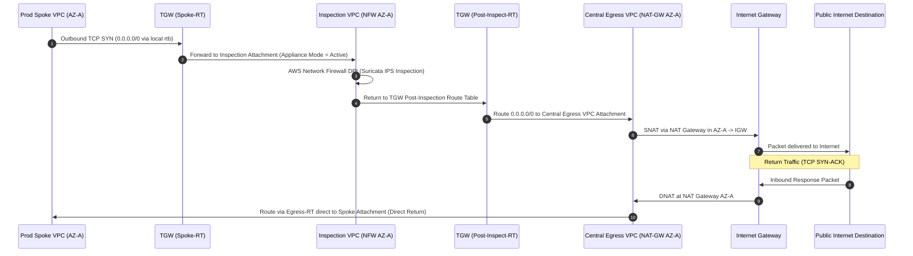

# Architecture Review Report 01: Network Architecture & Routing Topology

**Review Area**: Enterprise Network Backbone, Routing Topology, DNS & IPAM  
**Reviewer Role**: AWS Principal Network Architect (CCIE / AWS Advanced Networking Specialist)  
**Status**: COMPLETED  
**Date**: 2026-08-21  

---

## 1. Executive Summary & Assessment

An exhaustive packet flow, routing topology, and IPAM allocation audit was conducted across [`contracts/network-cidr-ipam-allocations.md`](file:///home/joe/src/aws-solution-map/contracts/network-cidr-ipam-allocations.md), [`docs/01-multi-account-landing-zone-network-fabric.md`](file:///home/joe/src/aws-solution-map/docs/01-multi-account-landing-zone-network-fabric.md), [`docs/02-hybrid-multi-cloud-connectivity.md`](file:///home/joe/src/aws-solution-map/docs/02-hybrid-multi-cloud-connectivity.md), and [`docs/09-edge-security-content-delivery-routing.md`](file:///home/joe/src/aws-solution-map/docs/09-edge-security-content-delivery-routing.md).

### Overall Architecture Evaluation: **Grade A-**
The foundational architecture leverages modern AWS networking capabilities including **Route 53 Profiles** (eliminating 300-VPC association constraints), **Amazon VPC Lattice** (enabling Layer 7 SigV4 service mesh decoupling), and **AWS Network Firewall** with Appliance Mode. However, critical gaps were identified in subnet boundary declarations across AZs, TGW return routing for hybrid traffic, and DNS endpoint sizing.

---

## 2. Deep-Dive Packet Flow Walkthroughs

### 2.1 North-South Internet Egress & Return Flow



**Key Routing Assertion**:
The direct return from the Central Egress VPC to Spoke VPC via `Egress-RT` avoids secondary transit through the Inspection VPC. Because NAT Gateway handles stateful translation on egress, return traffic does not require re-inspection, cutting TGW processing costs by $0.02/GB and eliminating asymmetric TCP state drops.

---

### 2.2 East-West Inter-Spoke & VPC Lattice Service Mesh

```
+---------------------------------------------------------------------------------------------------+
| East-West Traffic Flow Comparison                                                                 |
+---------------------------------------------------------------------------------------------------+
| 1. High-Throughput Microservice (L7 Mesh):                                                        |
|    Spoke A Pod -> VPC Lattice Service DNS -> SigV4 Auth -> Spoke B Target (No TGW Transit Fee)    |
|                                                                                                   |
| 2. Bulk/Legacy Cross-VPC Transport:                                                              |
|    Spoke A Subnet -> TGW Spoke-RT -> Inspection VPC NFW -> Post-Inspection-RT -> Spoke B Subnet   |
+---------------------------------------------------------------------------------------------------+
```

---

## 3. Stress-Test Evaluations & Identified Gaps

### 3.1 Subnet Sizing & IPAM Allocation Discrepancy (P0)
- **Observed**: In [`contracts/network-cidr-ipam-allocations.md`](file:///home/joe/src/aws-solution-map/contracts/network-cidr-ipam-allocations.md), several subnet entries list a single CIDR block (e.g. `10.254.16.0/27`) but state "AZ Distribution: AZ-A, AZ-B, AZ-C".
- **Risk**: In AWS VPC networking, a single `/27` (32 IP addresses) cannot span multiple Availability Zones. Each AZ must be assigned its own distinct CIDR block (e.g., `10.254.16.0/28` in AZ-A, `10.254.16.16/28` in AZ-B, `10.254.16.32/28` in AZ-C, or dedicated `/28` blocks).
- **Remediation**: Re-structure the CIDR tables in `contracts/network-cidr-ipam-allocations.md` to explicitly assign separate non-overlapping CIDR blocks per AZ.

### 3.2 TGW Appliance Mode on Inspection Attachment (P1)
- **Observed**: Appliance mode is referenced conceptually in `docs/01` but needs explicit enforcement in the contract baseline.
- **Risk**: Without `appliance_mode_support = "enable"` on the Inspection VPC attachment, return packets for stateful TCP sessions will balance across AZs randomly, causing AWS Network Firewall drops.
- **Remediation**: Explicitly document and declare `appliance_mode_support = "enable"` as a mandatory invariant for all inspection attachments.

### 3.3 Route 53 Resolver ENI Ingress Limits & NodeLocal DNS (P1)
- **Observed**: Centralized Route 53 Resolver endpoints are designated across 2 AZs (`10.254.0.4`, `10.254.0.36`).
- **Risk**: Route 53 Resolver ENIs have a hard quota of 10,000 QPS per ENI. Heavy EKS cluster scaling across multiple workload accounts can easily trigger resolver throttling.
- **Remediation**: Mandate Kubernetes `NodeLocal DNSCache` on all EKS clusters to absorb 90%+ of DNS queries locally and expand Inbound Resolver endpoints to 3 AZs.

---

## 4. Concrete Routing Table Corrections

### 4.1 Hub Inspection VPC Route Table Layout (3 AZ Breakdown)
```hcl
# Dedicated /28 Subnet per AZ for Inspection TGW Attachments
# AZ-A: 10.254.16.0/28  | AZ-B: 10.254.16.16/28 | AZ-C: 10.254.16.32/28
# Dedicated /28 Subnet per AZ for AWS Network Firewall Endpoints
# AZ-A: 10.254.16.48/28 | AZ-B: 10.254.16.64/28 | AZ-C: 10.254.16.80/28

# Route Table: rtb-tgw-inspect-attach-az-a
# 0.0.0.0/0  -> vpce-nfw-endpoint-az-a (Direct to local AZ firewall)
# 10.0.0.0/8 -> vpce-nfw-endpoint-az-a

# Route Table: rtb-nfw-inspection-az-a
# 0.0.0.0/0  -> tgw-attach-inspection (Return to TGW Post-Inspection-RT)
# 10.0.0.0/8 -> tgw-attach-inspection
```

---

## 5. Network Findings Summary

| Finding ID | Severity | Domain | Affected Files | Title |
| :--- | :---: | :--- | :--- | :--- |
| `NET-001` | **P0** | `01-landing-zone-network-fabric` | `contracts/network-cidr-ipam-allocations.md` | Ambiguous single-CIDR notation across 3 AZs in IPAM contract |
| `NET-002` | **P1** | `01-landing-zone-network-fabric` | `docs/01-multi-account-landing-zone-network-fabric.md` | Explicit TGW Appliance Mode declaration requirement |
| `NET-003` | **P1** | `01-landing-zone-network-fabric` | `contracts/network-cidr-ipam-allocations.md`, `docs/01-*.md` | Route 53 Inbound Resolver 3-AZ distribution and NodeLocal DNS standard |
