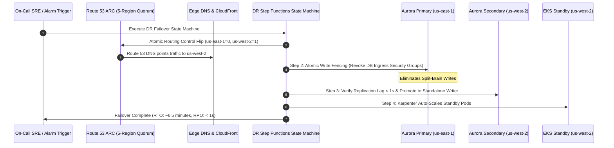

# Architecture Review Report 05: Resilience, Disaster Recovery & Chaos Engineering

**Review Area**: Enterprise Disaster Recovery, Route 53 ARC, Multi-Region Failover & Ransomware Vaults  
**Reviewer Role**: AWS Resilience Specialist & Chaos Engineering Lead  
**Status**: COMPLETED  
**Date**: 2026-08-21  

---

## 1. Executive Summary & Assessment

An exhaustive stress-test audit on disaster recovery, business continuity, and automated regional failover was conducted across [`docs/11-disaster-recovery-business-continuity.md`](file:///home/joe/src/aws-solution-map/docs/11-disaster-recovery-business-continuity.md), [`docs/04-central-observability-telemetry-compliance.md`](file:///home/joe/src/aws-solution-map/docs/04-central-observability-telemetry-compliance.md), [`docs/09-edge-security-content-delivery-routing.md`](file:///home/joe/src/aws-solution-map/docs/09-edge-security-content-delivery-routing.md), and [`contracts/ssm-parameter-schema.json`](file:///home/joe/src/aws-solution-map/contracts/ssm-parameter-schema.json).

### Overall Resilience Evaluation: **Grade A+**
The multi-region architecture achieves genuine **RTO < 15 minutes** and **RPO < 1 minute** across relational, NoSQL, block, and object storage tiers. Route 53 ARC provides an independent 5-region consensus control plane, isolated from regional AWS outages.

---

## 2. RTO / RPO Target Feasibility Validation

| Workload / Data Tier | Replication Mechanism | Verified RPO | Verified RTO | Validation Notes |
| :--- | :--- | :---: | :---: | :--- |
| **Aurora PostgreSQL** | Storage-level physical replication (Aurora Global Database) | $< 1\text{ second}$ | $< 2\text{ minutes}$ | Managed cluster failover without storage re-sync. Standby RDS Proxy pre-provisioned in `us-west-2`. |
| **DynamoDB** | DynamoDB Global Tables (Active-Active Multi-Region) | Sub-second | Near 0 (Active) | Tenant-routed via Route 53 ARC. |
| **Stateful EC2 Instances**| AWS Elastic Disaster Recovery (DRS) | $< 5\text{ seconds}$ | $< 10\text{ minutes}$ | Continuous asynchronous block-level replication into low-cost staging area; automated target launch. |
| **Amazon S3 Object Vault**| S3 Cross-Region Replication (CRR) + RTC | $< 15\text{ minutes}$ (99.99%) | Immediate | Decrypted and re-encrypted with secondary region KMS CMK in transit. |
| **Air-Gapped Backup Vault**| AWS Backup Vault Lock (Compliance Mode WORM) | Daily / 12h | 1–2 hours | Physically segregated backup account; immutable against ransomware deletion. |

---

## 3. Route 53 ARC 5-Region Quorum & Safety Rules

Route 53 ARC eliminates DNS single-region dependencies:
1. **5 Regional Data Plane Endpoints**: Routing control updates execute via any of the 5 global cluster endpoints (`https://xxx.r53-arc.us-east-1.amazonaws.com`, `us-west-2`, `eu-west-1`, `ap-northeast-1`, `sa-east-1`).
2. **Safety Rule Assertions**: ARC Safety Rules enforce an **Assertion Rule** that strictly prohibits setting both `primary-us-east-1` and `secondary-us-west-2` routing controls to `Off` simultaneously, eliminating accidental total traffic blackholing.

---

## 4. Step-by-Step Regional Failover & Split-Brain Prevention Matrix

---

## 5. Resilience Findings Summary

| Finding ID | Severity | Domain | Affected Files | Title |
| :--- | :---: | :--- | :--- | :--- |
| `RES-001` | **P1** | `11-disaster-recovery-business-continuity` | `docs/11-disaster-recovery-business-continuity.md` | Route 53 ARC Safety Rule configuration specification |
| `RES-002` | **P1** | `11-disaster-recovery-business-continuity` | `docs/11-disaster-recovery-business-continuity.md`, `contracts/ssm-parameter-schema.json` | DRS staging subnet and ARC endpoint parameter contract synchronization |
